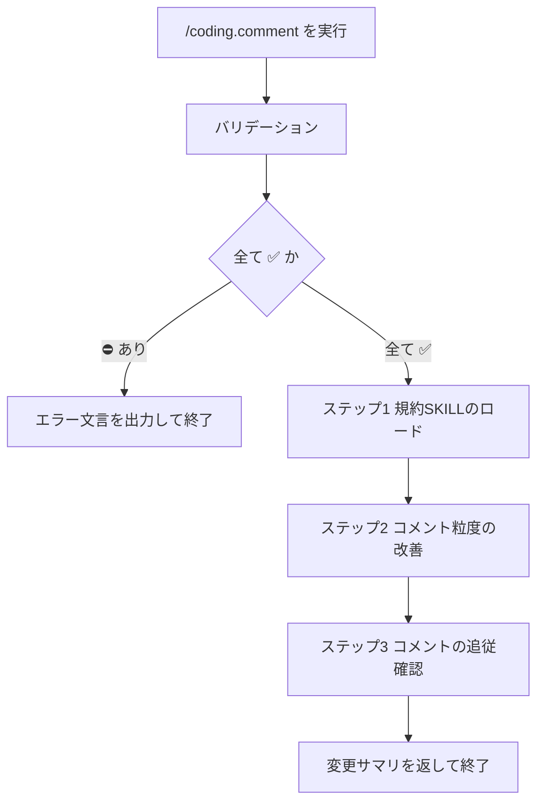

# コメント粒度の適正化

## 概要

指定範囲のコードコメントの粒度を、プロジェクト方針に合わせて適正化する。
`/coding.execute` の品質フォローアップ等から参照される補助コマンドである。

対象言語のコーディング規約 SKILL（例: `golang.coding-rules` / `flutter.coding-rules`）と、
各 `references/code_comment.md` を適用したうえで、コメントの追加・更新を行う。

## 入力

### Required: 対象コードのスコープ

コメント適正化の対象となるコード範囲。

* 確定方法: スラッシュコマンド引数、エディタの選択範囲、開いているファイル、会話文脈のいずれかから、ファイルパスと範囲（ファイル全体・関数・シンボル等）を特定する
* 不明確時: 対話で補完せず、エラー終了する

#### 対象コードのスコープ: 入力値の例

```text
path/to/user_service.go
path/to/preference_key.dart の PreferenceKey
選択中の FetchUser 関数
```

### Optional: コメント操作方針

コメントに対して許可する操作。

* 確定方法: 引数または会話文脈で明示されている場合のみ採用する
* 省略時: `追加・更新のみ`（削除は行わない）
* 不明確時（矛盾する指定がある等）: エラー終了する

#### コメント操作方針: 入力値の例

```text
追加・更新のみ
追加のみ
```

## 出力

### Required: コメントを適正化した対象コード

対象スコープ内のソースコードを、コメント規約に沿って更新した状態。

* 保存先: 対象ファイルそのもの（インプレース更新）
* 成功条件: スコープ内の不足・不整合コメントが規約どおり追加または更新されていること
* 既定方針では既存コメントの削除を行わないこと

### Optional: 変更サマリ

実施したコメント追加・更新の要点を、簡潔にユーザーへ返す。

#### 変更サマリ: 出力値の例

```text
対象: path/to/user_service.go（FetchUser）
- ドキュメントコメントを追加
- パラメータ制約を [externalID] 形式で追記
- 既存 NOTE を実装に合わせて更新
```

## 手順



### バリデーション

入力:

| Label | 値 | バリデーション |
| --- | --- | --- |
| 対象コードのスコープ | {確定したパスと範囲、または空} | ✅️ / ⛔️ |
| コメント操作方針 | {確定した方針、または「追加・更新のみ」（省略時既定）} | ✅️ / ⛔️ |

* 対象コードのスコープがファイルパスと範囲として特定できない場合は `⛔️`
* コメント操作方針が省略されている場合は既定 `追加・更新のみ` を採用し `✅️`
* コメント操作方針に矛盾・解釈不能な指定がある場合は `⛔️`
* 1つでも `⛔️` なら対話せずエラー終了する

```markdown
対象コードのスコープ が不明確です。
コマンドを終了します。
```

### ステップ1: 規約 SKILL のロード

* 対象コードの言語・拡張子から、必要なコーディング規約 SKILL をロードする
  * Go（`*.go`）: `golang.coding-rules` と [code_comment](../skills/golang.coding-rules/references/code_comment.md)
  * Dart（`*.dart`）: `flutter.coding-rules` と [code_comment](../skills/flutter.coding-rules/references/code_comment.md)
  * 上記以外: 対象リポジトリに存在する同種のコメント規約・コーディング規約をロードする
* 言語または適用すべき規約が特定できない場合は、次の文言で終了する

```markdown
適用するコメント規約 が不明確です。
コマンドを終了します。
```

### ステップ2: コメント粒度の改善

* ロードした規約と、本コマンドのナレッジベースに従い、対象スコープのコメントを適正化する
* コメント操作方針が `追加・更新のみ`（既定）または `追加のみ` の場合:
  * 不足しているドキュメントコメント・インラインコメントを追加する
  * `追加・更新のみ` のときは、実態と乖離したコメントを更新する
  * 自明であっても既存コメントの削除は行わない
* 関数（メソッド）のドキュメントコメントには、言語の記法に沿った example を用意する
* Internal / Private 等の可視性でコメント量を減らさない（Public と同等に対応する）

### ステップ3: コメントの追従確認

* 指定範囲のコード、および明らかに関連する近傍コードについて、コメントが実装実態に即しているか確認する
* 乖離があれば、コメント操作方針の範囲内で更新する（削除は行わない）
* 変更内容のサマリをユーザーへ返す

## ガードレール

* ユーザーと対話しない（確認質問・選択肢提示・追加情報の依頼を行わない）
* 入力・出力・手順が不明確な場合はエラー終了する
* エラー時は次の形式のみを返し、処理を止める:

```markdown
{XXXX} が不明確です。
コマンドを終了します。
```

* 対象スコープ外のファイル・ロジックを変更しない
* コメント以外のリファクタ（命名変更、処理の書き換え、フォーマット以外の構造変更）を行わない
* 既定のコメント操作方針では、既存コメントの削除を行わない（追加・更新のみ）
* 自動生成コード（例: `*.freezed.dart` / `*.gen.dart` / `*.g.dart`）へのコメント更新は行わない

## ナレッジベース

### DO: コメント箇所を指すことが自明な主語は省略する

* 「この関数は」「本メソッドは」など、箇所が自明な主語は書かない
* 主語が冗長であると判断した場合は、主語を削除して更新する

### DO: コードコメントは日本語の技術文として書く

* 日本語とEnglishが混ざっていても、不自然なスペースを空けない
* `` `OS` `` 等の引用符の前後ではスペースを開けてよい

### DO NOT: 単語ごとにスペースを入れてスペーシングする

* 理由: 「日本語 と English が混ざっていても このような スペーシング」は日本語文として不自然である

### DO: 基本的に1文ごとに改行する

* 1文が非常に長い場合は、適宜追加で改行する
* example の改行はコメント規約ではなく、コーディング規約に従う

### DO NOT: 複数文を1行に押し込む

* 理由: コメントの可読性が下がる

### DO: Internal / Private でも Public と同等のコメント粒度で対応する

* 可視性を理由にコメント量を増減しない

### DO NOT: 可視性が Internal / Private であることを理由にコメント量を減らす

* 理由: 可視性に依存せず、実装意図を同等に残すためである

### DO: 関数(メソッド)のコードコメントに言語の記法に沿った example を用意する

* example を省略したドキュメントコメントだけにしない

### DO: 不足・乖離しているインラインコメントは追加または更新する

* 自明であっても既存コメントは削除しない

### DO NOT: 自明であることを理由に既存コメントを削除する

* 理由: 既定のコメント操作方針は追加・更新のみである
