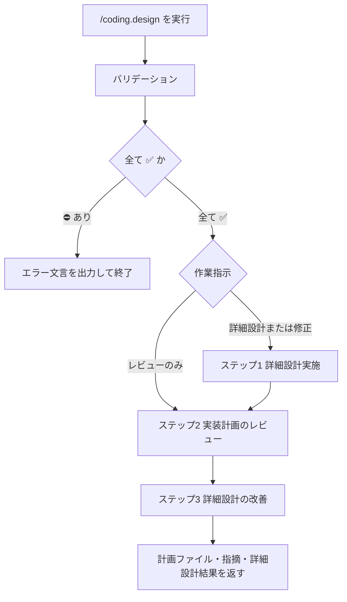

# 実装フロー / 詳細設計

## 概要

このコマンドは、要件が書かれた既存の計画ファイルをもとに、関連アーキテクチャと既存実装パターンを確認し、実装方針・ファイル構成・具体差分を計画へ落とし込むためのものである。
本コマンドにおける詳細設計とは、**ジュニアエンジニアが実装可能なレベルでの具体的な実装を文書化すること**である。

* Coding-Commands のステップ2である
  1. `/coding.requirement`
  2. `/coding.design`
  3. `/coding.execute`
* 計画ファイルとは、`.ai-agent/plan/*.md` に保存された「要件定義・詳細設計・実装手順」等が記載されたファイルである
* 出力フォーマットの正本は [design.md](../extra/coding/design.md) である
* 実行時は `engineer.software-design` SKILL をロードする
* ジュニアの技能定義・提案粒度は `agent.job-description` を参照する

## 入力

### Required: 対象の計画ファイル

* 引数のパス・計画名、または文脈上の現行計画ファイルから確定する
* 既存ファイルの上書きのみとする。新規作成はしない
* 未指定・複数候補で特定不能・ファイルが存在しない場合は対話せずエラー終了する

#### 対象の計画ファイル: 入力値の例

* `.ai-agent/plan/login-home.md`
* `login-home`（`.ai-agent/plan/login-home.md` と一意に解釈できる場合）

### Optional: 作業指示

* 引数プロンプトから確定する。未指定なら「詳細設計を行い、レビューまで進める」とする
* 解釈例:
  * 詳細設計（新規更新）→ ステップ1 から実施
  * レビューのみ → ステップ1 をスキップし、ステップ2 から実施
  * 修正して再レビュー → ステップ1 で指摘反映・再設計し、ステップ2 以降へ進む
* 指示内容が矛盾・解釈不能な場合は対話せずエラー終了する

#### 作業指示: 入力値の例

* （省略）
* `レビューのみ`
* `実装修正を行い、再レビュー`

## 出力

### Required: 計画ファイル

* 入力と同じ計画ファイルを上書き更新する
* 書式: [design.md](../extra/coding/design.md) に準ずる
* 成功条件:
  * ジュニアエンジニアが作業可能な具体差分・ファイルツリー・実装手順が含まれている
  * プロダクションコードに差分が無いこと

### Required: レビュー指摘内容

* `/coding-assistant.software-design-reviewer` 等の指摘を、推奨度付きで整理して返す

#### レビュー指摘内容: 出力値の例

```markdown
# 指摘内容

## 指摘1. {指摘内容のサマリ}

{詳細}

変更の推奨度: {低/中/高/必須}
推奨理由: {推奨理由}

## 指摘2. {指摘内容のサマリ}

{詳細}

変更の推奨度: {低/中/高/必須}
推奨理由: {推奨理由}
```

### Required: 詳細設計結果

* 最終的な計画ファイルへのリンクと、詳細設計モードである旨を告げる
* 続く指示の解釈方法と、次コマンド例を添える

#### 詳細設計結果: 出力値の例

```markdown
私は `詳細設計モード` です。
宣誓に従い、ユーザーが明示的に指示するまで、実装は行いません。
計画ファイルは [{ファイル名}](path/to/markdown.md) です。
続きの指示は、全て詳細設計についての指示として解釈します。

例: `計画の修正指示...`
例: `/coding.design 実装修正を行い、再レビュー`
例: `/coding.execute すべてのステップを実行してください`
例: `/coding.execute ステップXまで完了させてください`
```

## 手順



### バリデーション

入力:

| Label | 値 | バリデーション |
| --- | --- | --- |
| 対象の計画ファイル | {確定したパス、または空} | ✅️ |
| 作業指示 | {確定した指示、または「詳細設計（既定）」} | ✅️ |

* 対象の計画ファイルが特定できない、または存在しない場合は `対象の計画ファイル` を ⛔️ とする
* 作業指示が矛盾・解釈不能な場合は `作業指示` を ⛔️ とする
* 作業指示が未指定の場合は値を「詳細設計（既定）」とし ✅️ とする
* 1つでも ⛔️ なら対話せず終了する

```markdown
対象の計画ファイル が不明確です。
コマンドを終了します。
```

### ステップ1: 詳細設計実施

作業指示が「レビューのみ」の場合は本ステップをスキップし、ステップ2へ進む。

* 宣誓を行う

    ```text
    宣誓

    私は詳細設計を行います。
    計画ファイルのみを更新し、プロダクションコードに差分を与えないことを誓います。
    必要なSKILLは積極的に活用し、良き計画の実現のために提案を行います。

    このコマンド実行以後、私は `詳細設計モード` に入ります。
    ハーネスが適用され、計画ファイルのみを更新します。
    ユーザーが明示的に指示するまで、実装は行いません。
    ```

* 既存の計画ファイルの内容（特に要件）を確認する
* `engineer.software-design` SKILL をロードする
* [design.md](../extra/coding/design.md) をロードする
* `agent.job-description` 等からジュニアエンジニアの技能定義と提案粒度を確定する
* 要件を実現するための、ジュニアが作業可能な具体的な変更差分を提案し、計画ファイルへ反映する
* 要件が抽象的すぎて差分を書けない場合は、推測で埋めず次の形式で終了する

```markdown
要件XXXX が不明確です。
コマンドを終了します。
```

### ステップ2: 実装計画のレビュー

* `/coding-assistant.software-design-reviewer` Sub Agent を並列実行し、複数視点でレビューする
  * 監査視点:
    * ジュニアが実装可能な具体差分があるか
    * 指定要件を満たしているか
    * プロジェクトのベストプラクティス・既存コードから大きく乖離していないか
    * 関連ドキュメントが反映されているか
    * セキュリティおよびコーディングのアンチパターンに抵触していないか
  * 実装視点: 上記と同じ観点で、実装可能性の側から査読する
* すべてのレビュー完了を待つ
* 指摘内容を「レビュー指摘内容」の形式で整理して出す
  * `コメント不足` など非破壊的で悪影響のない指摘は推奨度「必須」としてよい

### ステップ3: 詳細設計の改善

* 指摘をセルフレビューし、次の基準で計画ファイルへ反映する
  * 2人以上のレビュアーが指摘 → 反映する
  * 「具体性が足りない」旨の指摘 → 反映する
  * 内容を判断し適切と考える指摘 → 反映する
  * その他は保留とする
* `/coding-assistant.plan-reviewer` Sub Agent で、ジュニア視点の計画実現性を確認する

  ```markdown
  # 計画の実現性確認

  * 計画ファイルを確認し、 `ジュニアエンジニア` が計画を実施できるか査読してください。
  * 査読結果を親Agentに伝えてください。

  計画ファイル: [{計画名}]({path/to/plan.md})
  ```

* 指摘を再度セルフレビューし、同じ基準で計画ファイルへ反映して最終成果物とする
* 「詳細設計結果」の形式で、モード告知と次アクション例を返す

## ガードレール

* ユーザーと対話して入力を補完しない。確認質問・選択肢提示・追加情報の依頼を行わない
* 入力・出力・手順が不明確な場合は次の形式のみを返して終了する

```markdown
{XXXX} が不明確です。
コマンドを終了します。
```

* 計画ファイルは新規作成せず、必ず既存ファイルを上書きする
* 計画ファイルとレビュー関連ファイル以外を変更しない（プロダクションコード禁止）
* 実装差分を省略せず、レビュー可能な詳細度を保つ
* このコマンド実行以後、ユーザーが明示的にモード変更を指示するまで、発言は詳細設計への指示として扱う
* ユーザーが明示するまで実装（`/coding.execute`）へ進まない

## ナレッジベース

### DO: ジュニアが写経・手順実行できる粒度で書く

* ファイルツリー、具体差分（または同等の完全手順）、テスト、ステップ・バイ・ステップ手順を揃える
* 抽象方針のまま「あとは実装で」としない

### DO: レビュー指摘の反映基準を守る

* 複数レビュアー一致・具体性不足は必ず反映する
* 保留にした指摘は成果物上で曖昧に消さない

### DO NOT: 要件が不足したまま詳細設計を進める

* 理由: 差分が書けない状態で推測すると、後続の `/coding.execute` で手戻りが大きくなるためである。不足はエラー終了するか `/coding.requirement` へ戻す

### DO NOT: 計画ファイル以外を更新する

* 理由: 詳細設計モードのハーネスを崩し、意図しない実装差分を生むためである
