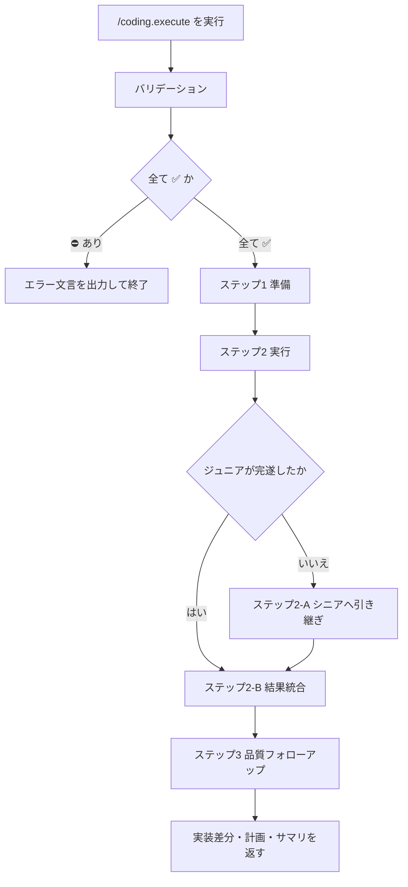

# 実装フロー / 実装反映

## 概要

このコマンドは、事前に構築された実装計画をもとに、プロダクションコードへ実装を反映するためのものである。

* Coding-Commands のステップ3である
  1. `/coding.requirement`
  2. `/coding.design`
  3. `/coding.execute`
* 計画ファイルとは、`.ai-agent/plan/*.md` に保存された「要件定義・詳細設計・実装手順」等が記載されたファイルである
* 詳細設計の書式正本は [design.md](../extra/coding/design.md) である
* Sub Agent への作業指示テンプレート正本は [work-orders.md](../extra/coding.execute/work-orders.md) である
* 本コマンド実行により、要件定義モード・詳細設計モードのハーネスは解除され、実コードの修正を行う

## 入力

### Required: 対象の計画ファイル

* 引数のパス・計画名、または文脈上の現行計画ファイルから確定する
* 詳細設計済み（実装手順・チェックリストが存在する）既存ファイルであること
* 未指定・複数候補で特定不能・ファイルが存在しない場合は対話せずエラー終了する

#### 対象の計画ファイル: 入力値の例

* `.ai-agent/plan/login-home.md`
* `login-home`（`.ai-agent/plan/login-home.md` と一意に解釈できる場合）

### Optional: 作業範囲

* 引数プロンプトから確定する。未指定なら計画内のすべての作業（未完了ステップ全体）とする
* 解釈例:
  * すべてのステップ
  * ステップXまで
  * ステップXのみ / ステップX〜Y
* 指定があるが計画内のステップと対応できない場合は対話せずエラー終了する

#### 作業範囲: 入力値の例

* （省略）→ 全作業
* `すべてのステップを実行してください`
* `ステップ3まで完了させてください`

## 出力

### Required: 実装差分

* 作業範囲に対応するプロダクションコード（および必要なテスト等）の変更
* 成功条件: 対象ステップが実装され、Formatter / Analyzer による機械的品質確認を経ていること

### Required: 更新された計画ファイル

* 入力と同じ計画ファイルを上書きし、実施したステップのチェックリスト状態を更新する
* チェックリスト記号はプロジェクトのルール（例: `[✅️]` / `[⚠️]` / `[-]` / `[?]`）に従う

### Required: 実行結果サマリ

* 完了したステップ、作業内容、残作業、次アクションの案内をユーザーへ返す
* 確認質問や追加情報の依頼は付けない（次の指示はユーザー発話を待つ）

#### 実行結果サマリ: 出力値の例

```markdown
{完了したステップ}

{作業内容のサマリ}

実装内容を確認し、次のステップに進むか、計画を調整するか指示をしてください。
計画ファイルは [{ファイル名}](path/to/markdown.md) です。

{次の作業ステップ}
{作業内容のサマリ}

{すべて完了した場合は、「すべて完了しました」等}
```

## 手順



### バリデーション

入力:

| Label | 値 | バリデーション |
| --- | --- | --- |
| 対象の計画ファイル | {確定したパス、または空} | ✅️ |
| 作業範囲 | {確定した範囲、または「全作業（既定）」} | ✅️ |

* 対象の計画ファイルが特定できない、または存在しない場合は `対象の計画ファイル` を ⛔️ とする
* 作業範囲が指定されているが計画のステップと対応できない場合は `作業範囲` を ⛔️ とする
* 作業範囲が未指定の場合は値を「全作業（既定）」とし ✅️ とする
* 1つでも ⛔️ なら対話せず終了する

```markdown
対象の計画ファイル が不明確です。
コマンドを終了します。
```

### ステップ1: 準備

* 計画ファイルをロードする
* 確定した作業範囲を次の形式で通知する（確認は求めない）

    ```text
    ユーザーによる計画実行の承認が行われました。
    計画モード・詳細設計モードのハーネスは解除され、実コードの修正を行います。

    {実行範囲}を実行します。
    ```

### ステップ2: 実行

* [work-orders.md](../extra/coding.execute/work-orders.md) の「ジュニアエンジニアへの作業指示」に従い、`/coding-assistant.junior-engineer` Sub Agent へ作業を依頼する
* ジュニアが対象ステップを完遂できなかった場合はステップ2-A を実施する。完遂した場合はステップ2-B へ進む

### ステップ2-A: シニアへ引き継ぎ

* [work-orders.md](../extra/coding.execute/work-orders.md) の「ジュニア失敗時のシニア引き継ぎ」に従い、`/coding-assistant.senior-engineer` へ未完了ステップの継続を依頼する
* 完了後、ステップ2-B へ進む

### ステップ2-B: 結果統合

* Sub Agent の返却結果を統合し、計画ファイルのチェックリストを更新する
* 実行途中のサマリを次の形式で通知する

    ```text
    {XXXXのステップをしました}

    {作業内容}

    {残作業}
    ```

### ステップ3: 品質フォローアップ

* [work-orders.md](../extra/coding.execute/work-orders.md) の「品質担保（シニア）」に従い、`/coding-assistant.senior-engineer` へ品質フォローアップを依頼する
  * コメント方針は `/coding.comment` も適宜参照する
* 実施内容に基づき、計画ファイルのチェックリストを更新する
* 「実行結果サマリ」の形式で最終結果を返す

## ガードレール

* ユーザーと対話して入力を補完しない。確認質問・選択肢提示・追加情報の依頼を行わない
* 入力または出力が不明確な場合は次の形式のみを返して終了する

```markdown
{XXXX} が不明確です。
コマンドを終了します。
```

* 作業範囲外の実装や、計画に無い大規模な設計変更を勝手に広げない
* 計画ファイルのチェックリスト更新を省略しない
* ジュニア失敗時は必ずシニアへ引き継ぎ、対象ステップを未完了のまま放置しない
* 機械的品質（Formatter / Analyzer）を省略しない

## ナレッジベース

### DO: 計画のステップ単位で依頼し、結果をチェックリストへ戻す

* Sub Agent への指示は作業範囲のステップを明示する
* 返却記号はプロジェクトのチェックリストルールに合わせる

### DO: ジュニア完遂不能ならシニアへ引き継ぐ

* 失敗ステップを親だけで曖昧に握りつぶさない
* 引き継ぎ後も同じ品質確認（コメント・Formatter / Analyzer）を課す

### DO NOT: 詳細設計モードのまま実装を始める

* 理由: `/coding.execute` はハーネス解除後の実装フェーズである。計画未承認・範囲未確定のまま進めない

### DO NOT: 作業範囲外のリファクタを混ぜる

* 理由: 計画と実装差分の対応が崩れ、レビューとロールバックが困難になるためである
