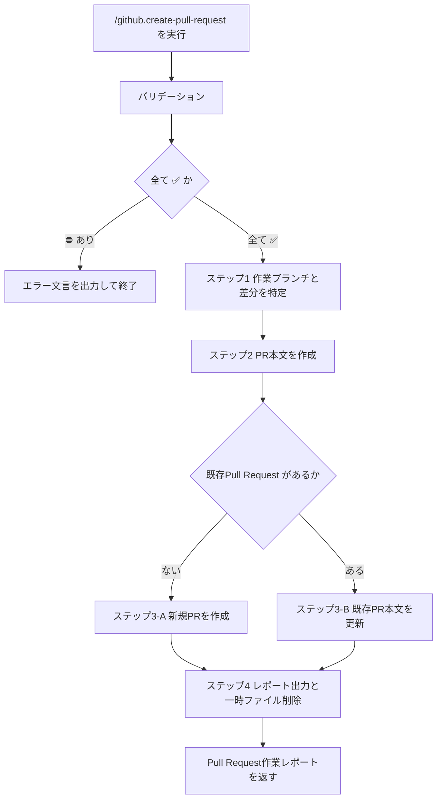

# github.create-pull-request

## 概要

このコマンドは、作業ブランチでの変更を Pull Request として GitHub に公開（または既存 PR 本文を上書き）する。

* PR 本文の正本: [template.md](../extra/github.create-pull-request/template.md)
* 一時ファイルの置き場は `workspace.agent-temporary`（`.ai-agent/tmp/`）に従う
* 新規作成と既存 PR 更新は、入力の有無で分岐する（対話で選ばない）

## 入力

### Optional: 対象リポジトリ

* 引数または文脈から GitHub リポジトリ（`OWNER/REPO` または clone URL）を確定する
* 未指定の場合は、現在の Git リポジトリの `origin` を対象とする
* 指定があるのに解釈不能、または未指定で `origin` を特定できない場合は対話せずエラー終了する

#### 対象リポジトリ: 入力値の例

* `eaglesakura/pocket_kosodate`
* `https://github.com/eaglesakura/pocket_kosodate.git`

### Optional: baseブランチ

* 引数または文脈から、マージ先ブランチ名を確定する
* 未指定の場合は `origin/main` を base とする（差分取得・`gh pr create --base` の両方）
* 指定があるのに解釈不能な場合は対話せずエラー終了する

#### baseブランチ: 入力値の例

* `main`
* `develop`
* `base は develop`（引数フレーズから確定）

### Optional: 既存Pull Request

* 引数または文脈から、更新対象の PR 番号または URL を確定する
* 指定がある場合は既存 PR の本文を上書きする（タイトル変更は行わない）
* 未指定の場合は新規に Pull Request を作成する
* 指定があるのに番号・URL として解釈不能な場合は対話せずエラー終了する

#### 既存Pull Request: 入力値の例

* `123`
* `https://github.com/OWNER/REPO/pull/123`
* `https://github.com/OWNER/REPO/pull/123 の本文を更新`

## 出力

### Required: Pull Request作業レポート

* 作成または更新した Pull Request のタイトル・本文・リポジトリ URL・PR URL をユーザーへ返す
* 成功条件:
  * `gh` による create または edit が成功している
  * レポートに Repository と Pull Request のリンクが含まれる
  * PR 本文用の一時ファイルを削除している

#### Pull Request作業レポート: 出力値の例

```markdown
# ログイン画面の初期表示を修正

# Summary
...

---
Repository: https://github.com/OWNER/REPO
Pull Request: [#123 ログイン画面の初期表示を修正](https://github.com/OWNER/REPO/pull/123)
```

## 手順



### バリデーション

入力:

| Label | 値 | バリデーション |
| --- | --- | --- |
| 対象リポジトリ | {OWNER/REPO または origin から確定した値、または空} | ✅️ |
| baseブランチ | {ブランチ名、または origin/main、または空} | ✅️ |
| 既存Pull Request | {PR番号またはURL、未指定なら空} | ✅️ |

* 対象リポジトリが指定済みで解釈不能、または未指定で `origin` を特定できない場合は `対象リポジトリ` を ⛔️ とする
* baseブランチが指定済みで解釈不能な場合は `baseブランチ` を ⛔️ とする（未指定は `origin/main` として ✅️）
* 既存Pull Request が指定済みで番号・URL として解釈不能な場合は `既存Pull Request` を ⛔️ とする（未指定は新規作成として ✅️）
* 1つでも ⛔️ なら対話せず終了する

```markdown
対象リポジトリ が不明確です。
コマンドを終了します。
```

または

```markdown
baseブランチ が不明確です。
コマンドを終了します。
```

または

```markdown
既存Pull Request が不明確です。
コマンドを終了します。
```

### ステップ1: 作業ブランチと差分を特定

* 作業ブランチ名を特定する

```bash
git rev-parse --abbrev-ref HEAD
```

* base（未指定時は `origin/main`）に対するコミットログと差分を取得し、PR タイトル・本文の材料とする

```bash
git log origin/main..HEAD --oneline
git diff origin/main HEAD
```

* base が `develop` 等の場合は、上記の `origin/main` を確定した base 参照に置き換える
* 作業ブランチが特定できない場合は次を出力して終了する

```markdown
作業ブランチ が不明確です。
コマンドを終了します。
```

### ステップ2: PR本文を作成

* [template.md](../extra/github.create-pull-request/template.md) をロードする
* ステップ1の差分・ログから Summary / Features / Fixed / Deleted を日本語で埋める
* 空セクションは残してよいが、該当が無い旨を無理に捏造しない
* `workspace.agent-temporary` に従い、本文を `.ai-agent/tmp/` 配下の一時ファイルへ保存する（例: `.ai-agent/tmp/pr-body.md`）

### ステップ3-A: 新規PRを作成

既存Pull Request が未指定の場合に実施する。

* 作業ブランチがリモートに無い、または tip が未 push なら `git push -u origin HEAD` する
* 次で Pull Request を作成する（`--repo` は対象リポジトリを明示する必要があるときのみ付与）

```bash
gh pr create --base main --title "{PRタイトル}" --body-file path/to/pr-body.md
```

* base がデフォルトの `main` 相当でも、確定した base ブランチ名を `--base` に渡す
* 作成に失敗し、出力として PR URL を特定できない場合は次を出力して終了する

```markdown
Pull Request作業レポート が不明確です。
コマンドを終了します。
```

### ステップ3-B: 既存PR本文を更新

既存Pull Request が指定されている場合に実施する。

* 次で本文のみを上書きする（タイトルは変更しない）

```bash
gh pr edit 123 --body-file path/to/pr-body.md
gh pr edit https://github.com/OWNER/REPO/pull/123 --body-file path/to/pr-body.md
```

* 更新に失敗し、対象 PR を特定できない場合は次を出力して終了する

```markdown
既存Pull Request が不明確です。
コマンドを終了します。
```

### ステップ4: レポート出力と一時ファイル削除

* 次の形式で作業レポートを出力する

```markdown
# {Pull Requestタイトル}

{Pull Request Body内容}

---
Repository: {https://path/to/repository}
Pull Request: [{#PR番号} {タイトル}]({PRへのリンク})
```

* PR 本文用の一時ファイルを削除する

## ガードレール

* ユーザーと対話して入力を補完しない。確認質問・選択肢提示・追加情報の依頼を行わない
* 入力・出力が不明確な場合は次の形式のみを返して終了する

```markdown
{XXXX} が不明確です。
コマンドを終了します。
```

* PR 本文は [template.md](../extra/github.create-pull-request/template.md) に従い、日本語で書く
* 一時ファイルは `.ai-agent/tmp/` のみに置き、レポート出力後に削除する
* 未コミット変更を勝手に commit しない
* force push（`push --force` 等）を行わない
* 既存 PR 更新時にタイトルや labels など本文以外を変更しない
* リポジトリのソースコードや計画ファイルを、本コマンドの目的外で変更しない

## ナレッジベース

### DO: 差分とログから事実ベースで本文を書く

* `git log` / `git diff` に現れる変更だけを Features / Fixed / Deleted に振り分ける

### DO: 一時本文は `.ai-agent/tmp/` に閉じる

* `workspace.agent-temporary` の解決順に従い、作業後は削除する

### DO NOT: 差分に無い変更を PR 本文へ書く

* 理由: レビュー観点がずれ、マージ判断を誤らせるためである

### DO NOT: 既存 PR 指定時に新規作成へフォールバックする

* 理由: 誤って二重 PR を作るためである。edit に失敗したらエラー終了する
