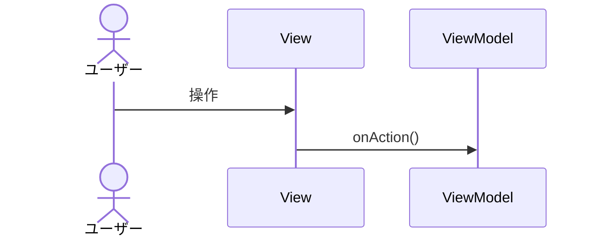

# 作図・パス記述

## 作図（Mermaid）

* 作図は [mermaid](https://mermaid.js.org/) を使う
* フェンス言語名は `mermaid`
* 用途例: `sequenceDiagram` / `flowchart` / `classDiagram` / `stateDiagram-v2`

## path 記述

* ワークスペース（または指定ルート）からの相対パスを使う
* 絶対パスは非推奨（環境差が出る）
* 区切りは `/`（Windows でも `\` にしない）

良い例: `docs/flutter/usecase.md`  
悪い例: `/Users/.../docs/flutter/usecase.md`

## パッケージ名

* Dart では `pubspec.yaml` の `name` を用いる
