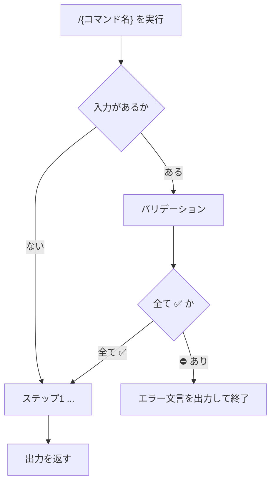

# {コマンド名}

## 概要

<!-- 
* このコマンドの利用目的
 -->

## 入力

<!-- 
* このコマンドが必要としているパラメータを明確化する
* 不明確な場合はユーザーへ質問せず、エラー終了する
 -->

### {Required | Optional}: {ラベル名}

<!-- 
* 入力値の説明
* プロンプト・文脈・ファイルのどれから確定するか
* 不明確時の扱い: エラー終了（対話で補完しない）
 -->

#### {ラベル名}: 入力値の例

<!-- 
入力値の例があれば記載する
 -->

## 出力

<!-- 
* このコマンドが生成・更新する成果物、またはユーザーへ返す結果を明確化する
* 出力定義が取れない場合もエラー終了する
 -->

### {Required | Optional}: {ラベル名}

<!-- 
* 期待される出力内容や、処理結果等を端的に伝える
* 保存先パス、成功条件、フォーマット参照先があれば記載する
 -->

#### {ラベル名}: 出力値の例

<!-- 
出力値の例があれば記載する
 -->

## 手順

<!-- 
* 直下に Mermaid の flowchart を置く
* 入力がある場合は `### バリデーション` を本処理の前に挿入する（無い場合は省略可）
* 続けてステップ見出しで作業内容を具体化する
* 図の流れと手順見出しを対応させる
* 入力・出力・手順が不明確な場合のエラー終了パスを含める
 -->



### バリデーション

<!-- 
* metadata.input が1件以上あるコマンドでは必須（Required / Optional を問わない）
* 見出し名は正確に「### バリデーション」（「### ステップ1: バリデーション」等にしない）
* 入力値を全て列挙し、妥当性を検証する
* 表の列は固定: Label | 値 | バリデーション
* 妥当性セルは ✅️ / ⛔️ のみ（条件を列見出しにしない）
* 1つでも ⛔️ なら対話せずエラー終了する
 -->

```markdown
入力:

| Label | 値 | バリデーション |
| --- | --- | --- |
| {ラベル名} | {確定した値、または空} | ✅️ / ⛔️ |
| {ラベル名} | {確定した値、または空} | ✅️ / ⛔️ |
```

<!-- 
全て ✅️ のときだけ次ステップへ進む。
⛔️ がある場合:

```markdown
{XXXX} が不明確です。
コマンドを終了します。
```
 -->

### ステップ{n}: {タイトル}

<!-- 
* 作業内容を箇条書き
* 必要に応じて図説やコマンド例等も記載する
* 分岐する場合は、 "XXXの場合はステップn-Aを実施" 等、分岐を明確化する
 -->

### ステップ{n-A}: {タイトル}

<!-- 
* 作業内容を箇条書き
* 必要に応じて図説やコマンド例等も記載する
 -->

## ガードレール

<!-- 
* ユーザーと対話しない（確認質問・追加依頼を行わない）
* 入力・出力・手順が不明確な場合はエラー終了する
* エラー時は次の形式のみを返し、処理を止める:

```markdown
{XXXX} が不明確です。
コマンドを終了します。
```

* 変更してよいファイル範囲、その他の禁止事項・モード制約
 -->

## ナレッジベース

<!-- 
* 必要に応じて、過去のナレッジを記載する
* 不要なら本セクションごと省略してよい
 -->
