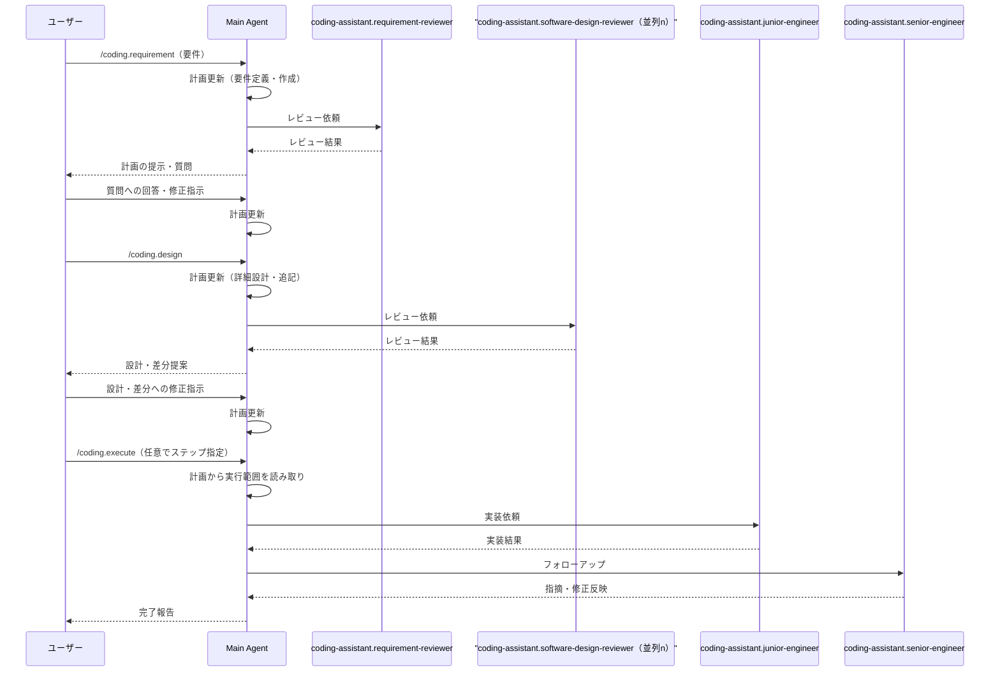

# `/coding.*` コマンド

## AI駆動開発

* AI Agentによる開発を円滑に行うため、コード生成は3ステップに分割されている
    1. 要件定義
    2. 詳細設計
    3. 実施
* Cursorの `Auto` Agentモードに最適化されている
  * これは個人開発者の課金額に最適化したもので、業務利用のように課金額の上限が高い場合はより良いModel・大量のContext・高い並列性に最適化すべきである
* 1つのAgentチャットで行うことを推奨する
* Context量が増えた場合、適宜 `/Summarize` で要約して良い
* 計画ドキュメントとして出力されることで、初手からコードを変更するよりも設計上の考慮をしやすい利点がある

## 利用手順

### ステップ1: `/coding.requirement` コマンド

* 要件定義を行う粒度はコーディングを行うエンジニアの裁量であり、CursorのAutoモードのContext量（200k Token程度）に実装が収まるよう想定した分量する
* Cursor Autoモードは、一つの画面をすべて一度に実装するほどの現実的なContext量・実装能力を持たないため、 `状態設計` `UI設計` `統合`等、適宜エンジニア自身が分割することが望ましい

利用例:

```text
/coding.requirement

# 要件

* ログインを行う画面のStateを実装する
* 要素
    * ユーザーメールアドレス入力フォーム
    * パスワード入力フォーム
    * 規約同意チェック
    * ログインボタン
```

* コマンドを実行すると、定義漏れや暗黙的要件の明文化を促されるため、適宜質問に回答する

### ステップ2: `/coding.design` コマンド

* 要件がまとまったら、 `/coding.design` で、実際のコード差分の提案を受ける

利用例:

```text
/coding.design
```

* 提案されたコードに対し、適宜修正を行う

### ステップ3: `/coding.execute` コマンド

* コード差分の提案に問題がないと判断したら、 `/coding.design` で、実施を行う
* ステップ・バイ・ステップとして手順が文書化されているため、特定のステップだけを実施することが可能

利用例: 計画をすべて承認し、実行完了させる

```text
/coding.execute
```

利用例: 計画の一部を承認し、実行させる

```text
/coding.execute ステップ1を完了させてください
```

```text
/coding.execute ステップ1, 3, 5を完了させてください
```

## コマンドのアーキテクチャ


