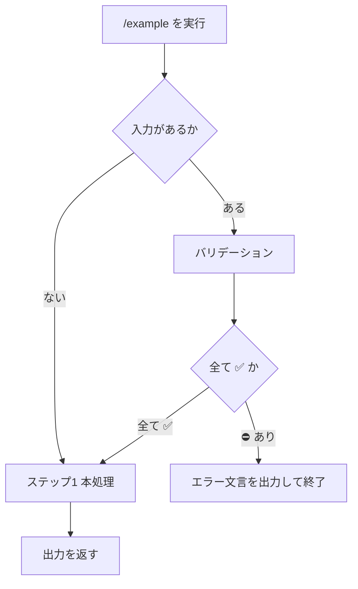

# Tool / Cursor Slash-Command Creator

slash-command は Agent が実行する再利用可能な手順書である。
入力・出力・関連資源・手順の分岐を本文で明示し、後続 Agent が迷わず実行できるようにする。

## いつ使うか / 使わないか

* 使う: `.cursor/commands/` に配置する Cursor slash-command の作成・改訂
* 使わない: Agent Skill（`.cursor/skills/**/SKILL.md`）の作成（`skill-creator` 等）
* 使わない: 一度きりの会話プロンプトの下書きだけ（ファイルとして残さない場合）

## 出力先と命名

* プロジェクト共有: `.cursor/commands/{command-name}.md`
* APM パッケージのソース: `.apm/prompts/{command-name}.prompt.md`（install 後に `.cursor/commands/` 等へ展開される）
* ファイル名がコマンド名になる（例: `docs.render.md` → `/docs.render`）
* このリポジトリでは `{領域}.{動詞や目的}` のドット区切りを推奨する（例: `docs.format-plan`, `git.preflight`）
* 本文 H1 はファイル名ではなく、内容要約のタイトル（例: `実装フロー / 要件定義`）にする

## 共有アセット

コマンド本文に長い書式・テンプレート・複数コマンドで共有する資料を埋め込まない。
ファイル参照は `## 関連ファイル`、探索ディレクトリは `## アセットディレクトリ` に分ける。

### リポジトリ直下のコマンド（未パッケージ）

* 配置: `.cursor/extra/{領域またはコマンド名}/...`
  * 領域共有の例: `.cursor/extra/docs/requirements.md`
* コマンドからの参照は相対パス（例: `[requirements.md](../extra/docs/requirements.md)`）
* `{assets}/` を使う場合は `## アセットディレクトリ` に候補ディレクトリを列挙する

### APM パッケージ内のコマンド

* ソース配置: `.apm/assets/{領域またはコマンド名}/...`
  * 例: `.apm/assets/example.command/template.md`
* 本文・`## 関連ファイル` ではインストール先の 1 パスを直書きせず、`{assets}/...` メタ変数を使う
  * 例: `{assets}/template.md`
* `{assets}/` を使う場合は、本文の `## アセットディレクトリ` に実ディレクトリ候補を列挙する（正本）
  * ソース相対（開発時）: `../assets/example.command/`
  * install 後ルート相対: `apm_modules/eaglesakura/agent-skills/packages/agent-creator/.apm/assets/example.command/`
* 旧来の `metadata.assets` だけがある文書も `workspace-resolve-agent-assets` は読めるが、新規・改訂では本文セクションへ書く
* 実行時の実体解決は `workspace-resolve-agent-assets` に従う（文書相対とワークスペースルート相対の両方を試し、ヒットを示す）

コマンド単体に閉じる短い例示だけなら本文に書いてよい。書式の正本・長いテンプレート・共有ルールはアセットへ寄せる。

## 必須: テンプレート準拠

出力は必ず [assets/command.md](./assets/command.md) に従う。
プレースホルダ（`{...}`）と HTML コメントは最終成果物から除去する。

## 生成コマンドの実行契約（必須）

作成・改訂する slash-command 自体が、実行時に次を守るように書く。

### 非対話

* ユーザーへの確認質問・選択肢提示・追加情報の依頼を行わない
* 不足情報を対話で補完せず、文脈・引数・既存ファイルから確定できる範囲だけを使う

### 不明確はエラー終了（実行時）

次のいずれかが明確にならない場合は、処理を続けずエラーとして終了する。

* 入力（Required の欠落、解釈不能、矛盾）
* 出力（保存先・形式・成功条件が特定できない）

**手順の不明確は実行時エラーにしない。** 生成コマンドの最終出力（手順・ガードレール・フローチャート）に「手順が不明確です」等の分岐を書かない。

### 手順の明確性（作成・編集時に保証）

手順はコマンド作成・改訂の時点で検証し、実行時に迷わない状態にしてから書き出す。

* 分岐条件・次ステップ・成功／失敗の扱いが本文とフローチャートで一意に辿れること
* 「どちらを行うか判断できない」箇所が残っているなら、コマンドを確定出力せず、手順を直してから保存する
* 実行時バリデーションの対象は入力（および必要なら出力定義の特定）に限定する

### エラー文言

入力または出力が不明確なときのエラーは、次の形式でユーザーへ伝え、そこでコマンドを終了する。質問や再入力の促しは付けない。

```markdown
{XXXX} が不明確です。
コマンドを終了します。
```

`{XXXX}` には不明確な対象を具体名で入れる（例: `対象の計画ファイル`、`動作モード`、`出力先パス`）。
複数ある場合は、主要なものを先に1つ示してよい（長文の質問リストにはしない）。

手順のフローチャートと初期ステップ（バリデーション）に、**入力／出力**の不明確に対するエラー終了パスを含める。
ガードレールにも「ユーザーと対話しない」「入力・出力が不明確なら上記文言で終了する」を明記する（手順の不明確は記載しない）。

## frontmatter の書き方

APM がサポートする frontmatter に合わせ、次だけを書く。ヘルプ・入出力・呼び出し例・関連参照・アセット探索先は本文へ置く（旧来の `metadata.help` / `input` / `output` / `example` / `references` / `assets` は新規では使わない）。

| フィールド | 役割 |
| --- | --- |
| `description` | コマンドの目的・処理概要（**必須**。Cursor 等へ展開される要約） |
| `license` | ライセンス（**Optional**。入れるなら `MIT License` 等） |
| `metadata.author` | 作成者（**Optional**。ユーザーが指定したときだけ書く。既定値で埋めない） |

```yaml
---
license: MIT License
description: >-
  {このコマンドの目的、大まかな処理内容等の概要説明}
metadata:
  author: "@eaglesakura"
---
```

### description の記載規則

* チャットで `/command` を選ぶときの手がかりになる短文にする
* 目的・主な入出力・省略時の既定があれば触れる
* 本文 `## Help情報` と矛盾させない（詳細・呼び出し例は本文側）

## 本文セクション

テンプレートの見出し順を守る。

1. **タイトル（H1）** — コマンド内容が1行でわかる表記。形式は `{領域} / {内容}`（例: `実装フロー / 要件定義`、`GitHub / Pull Request作成`）。ファイル名や `/command` 文字列はタイトルにしない
2. **Help情報** — 利用方法。続けて `### Example` にチャットへ打つ呼び出し例（`/コマンド名` から始まる）を最低1件
3. **関連ファイル** — 関連コマンド・SKILL・共有アセット・ドキュメントを箇条書き。なければ「単独完結」と Help情報に書くか、セクションを最小限にする
4. **アセットディレクトリ** — `{assets}/...` を使う場合のみ。探索先ディレクトリを箇条書き。使わないならセクションごと省略
5. **入力** — `### Required|Optional: {ラベル}`。確定方法（引数・文脈・ファイル）を書く。不明時は対話せずエラー終了する条件も書く
6. **出力** — 成果物の場所・形式・成功条件。例があれば `####` で示す。出力定義が取れない場合のエラーも書く
7. **手順** — 先に Mermaid フローチャート、続けて（入力があるなら）固定見出し `### バリデーション`、その後 `### ステップ{n}`。分岐は `ステップ{n-A}` 等で明示する。手順自体は作成時点で一意に辿れること
8. **ガードレール** — 非対話・入力／出力不明確時のエラー終了・その他の禁止事項（手順不明確の実行時エラーは書かない）
9. **ナレッジベース** — 繰り返し効く判断基準。`### DO:` / `### DO NOT:` 見出し形式（`markdown-documentation` と同じ）。なければセクションごと省略

### Example の記載規則

利用者が `/` で呼ぶときの具体例を `### Example` に載せる。`description` や Help情報の抽象説明だけでは呼び出し方が伝わりにくいためである。

* 各例は、実際にチャットへ入力する文字列（`/コマンド名` から始まる）
* 最低1件。引数あり／なし、典型的な追加プロンプトなど、利用パターンが分かれるなら複数件
* 「入力」の Required / Optional と矛盾しない（Required があるのに引数なし例だけのときは、引数あり例も添える）

```text
/docs.format-plan
```

```text
/docs.format-plan .ai-agent/plan/foo.md を要件定義モードで整形
```

### 関連ファイルの記載規則

関連があれば必ず `## 関連ファイル` に載せる。特に次を優先する。

* 前後関係のある slash-command（例: `/docs.requirement` → `/docs.design`）
* 同一領域の補助コマンドで、個別列挙よりファミリー参照が適切な場合は `/docs.*` のように記載する
* 実行時にロードすべき SKILL
* `.cursor/extra/` 配下の共有アセット・書式テンプレート（Markdown リンク）
* APM アセットのファイル参照は `{assets}/...`（探索先ディレクトリは `## アセットディレクトリ`）
* その他の関連ドキュメント（Markdown リンク可）

```markdown
## 関連ファイル

* `/docs.*`
* `/docs.requirement`
* `/docs.design`
* `markdown-documentation`
* [requirements.md](../extra/docs/requirements.md)
```

関連が無い場合は空のまま残さず、少なくとも自分自身の位置づけが分かる参照（親ワークフローや補助コマンド）を残すか、意図的に「単独完結」と Help情報に書く。
ファミリー参照（`/領域.*`）と個別コマンドは併用してよい。補助コマンドはファミリー、パイプライン前後は個別、が典型である。

### アセットディレクトリの記載規則

`{assets}/...` を本文・関連ファイルで使う場合に限り、`## アセットディレクトリ` を置く。使わないコマンドではセクションごと省略する。

* 各行はディレクトリパス（ファイルパスではない）
* 文書相対（このコマンドファイルから）またはリポジトリルート相対
* 開発時と install 後の両方を並べると、APM 展開先でも解決しやすい
* Markdown リンク `[label](path)` 形式でもよい（`path` をディレクトリとして使う）
* `{assets}/foo.md` の解決は `workspace-resolve-agent-assets` が本セクション（および互換の `metadata.assets`）から候補を読む

```markdown
## アセットディレクトリ

* `../assets/example.command/`
* `apm_modules/eaglesakura/agent-skills/packages/agent-creator/.apm/assets/example.command/`
```

## バリデーションステップ（入力がある場合は必須）

本文 `## 入力` に1件でもあるコマンド（Required / Optional を問わない）では、本処理の前にバリデーションを置く。
省略してよいのは、入力が空で検証対象が本当に無い場合だけである。

ここが抜けると実行時に「何を見て止めたか」が残らず、非対話契約も崩れる。見出し名・表形式は次に固定する（言い換えない）。

### 必須の見出し

* 見出しは正確に `### バリデーション` とする
* `### ステップ1: バリデーション` や `### ステップ0: バリデーション` にはしない（本処理ステップと混ぜない）

### 必須の表形式

実行時に Agent が埋める表を、次の列構成でそのまま載せる。

```markdown
入力:

| Label | 値 | バリデーション |
| --- | --- | --- |
| {ラベル名} | {確定した値、または空} | ✅️ |
| {ラベル名} | {確定した値、または空} | ⛔️ |
```

* 1列目 `Label`: 本文「入力」のラベルと対応させる
* 2列目 `値`: 確定値。未確定なら空または「（未確定）」
* 3列目 `バリデーション`: セルは `✅️` または `⛔️` のみ（条件文を列にしない）
* 「入力」の全件を行にする（Optional の省略可能入力も行として残す）

### 失敗時

* 1つでも `⛔️` なら対話せず、規定のエラー文言で終了する
* フローチャートにもバリデーションノードと `✅️` / `⛔️` 分岐を含める

```markdown
動作モード が不明確です。
コマンドを終了します。
```

### やってはいけないこと（よくある抜け）

* フローチャートにだけ「バリデーション」と書いて、本文に `### バリデーション` と表を置かない
* 表の列を `| 条件 | ✅️ | ⛔️ |` のように自作する（判定記号を列見出しにしない）
* バリデーションを `### ステップ{n}` に統合して見出し名を変える
* Optional 入力だからといってバリデーションごと省略する

## フローチャート（必須）

手順の見通しを揃えるため、`## 手順` 直下に Mermaid の `flowchart` を置く。

* 処理は矩形、分岐は菱形で表す（`flowchart TD` を基本とする）
* 主系列のステップと分岐をノード／エッジで示し、分岐先は `ステップ{n-A}` 等と対応させる
* 入力がある場合はバリデーションノードと `✅️` / `⛔️` 分岐を含める
* 図と手順見出しの番号・意味を対応させる（図だけ・本文だけの片落ちを避ける）



## 作業手順

### ステップ1: 要件の収集

ユーザー依頼と既存コマンド（同領域の `.cursor/commands/*.md` や `.apm/prompts/*.prompt.md`）から、次を確定する。

* コマンド名（ファイル名）
* H1 タイトル（`{領域} / {内容}` で1行要約）
* `description`（目的の要約）
* 目的・非目的（ガードレールの種）
* Help情報 / Example
* 入力 / 出力（Required / Optional）
* 関連コマンド・SKILL・ドキュメント
* 分岐条件

不足は推測で埋めず、質問してからドラフトする。

### ステップ2: frontmatter と Help の下書き

`description` を先に書き、契約の要約を固定する。
`license` / `metadata.author` は **Optional**。ユーザーが指定したときだけ含め、こちらから埋め込まない。
`{assets}/` が必要なら本文の `## アセットディレクトリ` を書く。旧 metadata（`help` / `input` / `output` / `example` / `references` / `assets`）は書かない。

続けて本文の `## Help情報` と `### Example` を書き、利用者が打つ `/コマンド名 ...` の具体例を最低1件入れる。
関連コマンドがある場合は、呼び出し順や前提関係が Help情報か `## 関連ファイル` から分かるようにする。

### ステップ3: 手順とフローチャート

1. ステップ一覧（分岐含む）を列挙し、どの入力状態でも次に進むステップが一意か検証する（曖昧ならここで直す）
2. 「入力」が1件以上なら、見出しを正確に `### バリデーション` とし、`| Label | 値 | バリデーション |` 表（セルは ✅️/⛔️）を置く
3. 対応する `flowchart` を書く（入力バリデーション分岐を含める。手順不明確の分岐は置かない）
4. 各 `### ステップ{n}` に作業内容・コマンド例・チェックリストを落とす（バリデーションをステップ番号に溶かさない）

### ステップ4: 本文の完成と配置

* [assets/command.md](./assets/command.md) に沿って Markdown を完成させる
* 共有アセット・長いテンプレートが必要なら `.cursor/extra/{領域またはコマンド名}/`（または `.apm/assets/...`）に配置し、コマンドから相対リンクまたは `{assets}/` で参照する
* `.cursor/commands/{command-name}.md`（または `.apm/prompts/{command-name}.prompt.md`）へ書き出す（改訂時は差分の意図を保つ）
* プレースホルダ・説明用 HTML コメントが残っていないことを確認する

### ステップ5: 自己レビュー

* [ ] H1 タイトルが `{領域} / {内容}` 形式で、コマンド内容が1行でわかる（ファイル名や `/command` ではない）
* [ ] frontmatter は `description`（必須）と任意の `license` / `metadata.author` のみ（旧 `metadata.help|input|output|example|references|assets` が無い）
* [ ] 本文に `## Help情報` と `### Example` があり、`/コマンド名` から始まる呼び出し例が1件以上ある
* [ ] 本文の「入力」「出力」が Help情報・Example と矛盾していない
* [ ] `## 関連ファイル` に関連コマンド・SKILL・共有アセットが載っている（ある場合）。補助コマンドなら `/領域.*` も検討する
* [ ] `{assets}/` を使う場合: `## アセットディレクトリ` に探索先が列挙されている（使わないならセクション無し）
* [ ] 共有・長文アセットは `.cursor/extra/` または `.apm/assets/` にあり、本文からリンク／`{assets}/` されている（ある場合）
* [ ] フローチャートがあり、手順見出しと対応している
* [ ] 手順・分岐が一意で、「手順が不明確」な実行時エラー分岐が最終出力に含まれていない
* [ ] 「入力」がある場合: 見出しが正確に `### バリデーション` である（`ステップN: バリデーション` ではない）
* [ ] 同上: 表が `| Label | 値 | バリデーション |` で、判定セルが ✅️/⛔️ である
* [ ] ナレッジベースがある場合: 見出しが `### DO:` / `### DO NOT:` 形式である（トピック見出し＋箇条書き DO ではない）
* [ ] 非対話・入力／出力不明確時のエラー文言が手順とガードレールに書かれている
* [ ] ガードレールが実行時の禁止事項として具体的である
* [ ] ファイル名が `/` で呼びたいコマンド名と一致している

## 品質の目安

別セッションの Agent が、会話履歴なしでも本文の Help・入出力・手順だけで同じ成果を出せること。
不明な入力・出力に対して質問せず、規定のエラー文言で終了できること。
手順は作成時点で明確であり、実行時に手順選択で迷わないこと。

## 関連

* コマンド記述のツールチェイン例は `tool-skill-creator-extension`（SKILL 向け）とは別物。slash-command 本文のシェル例は、対象リポジトリの `AGENTS.md` 実行規約に合わせてよい
* `{assets}/` の実体解決は `workspace-resolve-agent-assets` を使う
* 既存コマンドの書式が古い場合でも、新規・改訂の出力は本テンプレートに寄せる
