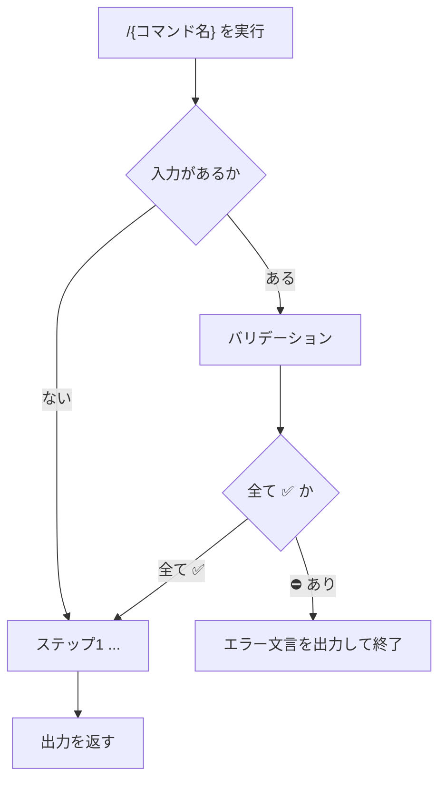

# {領域} / {内容の要約}

<!-- 
* H1 はスラッシュコマンド名ではなく、内容が一目でわかるタイトルにする
* 形式の目安: `{領域} / {動詞や成果}`
  例: `実装フロー / 要件定義`
  例: `GitHub / Pull Request作成`
  例: `計画ファイル / 書式整形`
* ファイル名（`coding.requirement.md`）や `/coding.requirement` はタイトルに使わない
 -->

## Help情報

<!-- 
利用方法等のテキスト.
 -->

### Example

<!-- 
利用例等の追加情報.
 -->

```text
/{コマンド名}
```

```text
/{コマンド名} {追加プロンプトの例}
```

## 関連ファイル

<!-- 
* 関連ファイル、SKILL等がある場合は箇条書きで記載
 -->

## アセットディレクトリ

<!-- 
* `{assets}/...` を本文で使う場合に記載する（使わないならセクションごと省略可）
* 参照すべきアセットディレクトリ一覧を箇条書きで記載する
* `{assets}/example.txt` のように書かれた参照は、ここに列挙したディレクトリから検索する
* 各行は「このファイルからの相対パス」または「リポジトリルートからの相対パス」
* 開発時（ソース相対）と install 後（ルート相対）の両方を並べると解決が安定する
  例:
  * `../assets/example.command/`
  * `apm_modules/eaglesakura/agent-skills/packages/agent-creator/.apm/assets/example.command/`
 -->

## 入力

<!-- 
* このコマンドが必要としているパラメータを明確化する
* 不明確な場合はユーザーへ質問せず、エラー終了する
 -->

### {Required | Optional}: {ラベル名}

<!-- 
* 入力値の説明
* プロンプト・文脈・ファイルのどれから確定するか
* 不明確時の扱い: エラー終了（対話で補完しない）
 -->

#### {ラベル名}: 入力値の例

<!-- 
入力値の例があれば記載する
 -->

## 出力

<!-- 
* このコマンドが生成・更新する成果物、またはユーザーへ返す結果を明確化する
* 出力定義が取れない場合もエラー終了する
 -->

### {Required | Optional}: {ラベル名}

<!-- 
* 期待される出力内容や、処理結果等を端的に伝える
* 保存先パス、成功条件、フォーマット参照先があれば記載する
 -->

#### {ラベル名}: 出力値の例

<!-- 
出力値の例があれば記載する
 -->

## 手順

<!-- 
* 直下に Mermaid の flowchart を置く
* 入力がある場合は `### バリデーション` を本処理の前に挿入する（無い場合は省略可）
* 続けてステップ見出しで作業内容を具体化する
* 図の流れと手順見出しを対応させる
* 手順は作成時点で一意に辿れること（実行時に「手順が不明確」としない）
* 入力・出力が不明確な場合のエラー終了パスを含める
 -->



### バリデーション

<!-- 
* 本文「入力」が1件以上あるコマンドでは必須（Required / Optional を問わない）
* 見出し名は正確に「### バリデーション」（「### ステップ1: バリデーション」等にしない）
* 入力値を全て列挙し、妥当性を検証する
* 表の列は固定: Label | 値 | バリデーション
* 妥当性セルは ✅️ / ⛔️ のみ（条件を列見出しにしない）
* 1つでも ⛔️ なら対話せずエラー終了する
 -->

```markdown
入力:

| Label | 値 | バリデーション |
| --- | --- | --- |
| {ラベル名} | {確定した値、または空} | ✅️ / ⛔️ |
| {ラベル名} | {確定した値、または空} | ✅️ / ⛔️ |
```

<!-- 
全て ✅️ のときだけ次ステップへ進む。
⛔️ がある場合:

```markdown
{XXXX} が不明確です。
コマンドを終了します。
```
 -->

### ステップ{n}: {タイトル}

<!-- 
* 作業内容を箇条書き
* 必要に応じて図説やコマンド例等も記載する
* 分岐する場合は、 "XXXの場合はステップn-Aを実施" 等、分岐を明確化する
* 分岐条件が曖昧なまま残さない（作成時に手順を確定する）
 -->

### ステップ{n-A}: {タイトル}

<!-- 
* 作業内容を箇条書き
* 必要に応じて図説やコマンド例等も記載する
 -->

## ガードレール

<!-- 
* ユーザーと対話しない（確認質問・追加依頼を行わない）
* 入力・出力が不明確な場合はエラー終了する（手順の不明確は実行時エラーにしない）
* エラー時は次の形式のみを返し、処理を止める:

```markdown
{XXXX} が不明確です。
コマンドを終了します。
```

* 変更してよいファイル範囲、その他の禁止事項・モード制約
 -->

## ナレッジベース

<!-- 
* 繰り返し効く判断基準があるときだけ記載する
* 不要なら本セクションごと省略してよい
* markdown-documentation と同様、見出しは `### DO:` / `### DO NOT:` 形式とする
* 二重否定を避け、テキストは DO / DO NOT で揃える
* トピックが増える場合は、DO / DO NOT 見出しを必要な数だけ並べる
 -->

### DO: {1行で内容を端的に表す}

* {推奨パターンの説明や example}

### DO NOT: {1行で内容を端的に表す（二重否定にしない）}

* 理由: {避ける理由}
