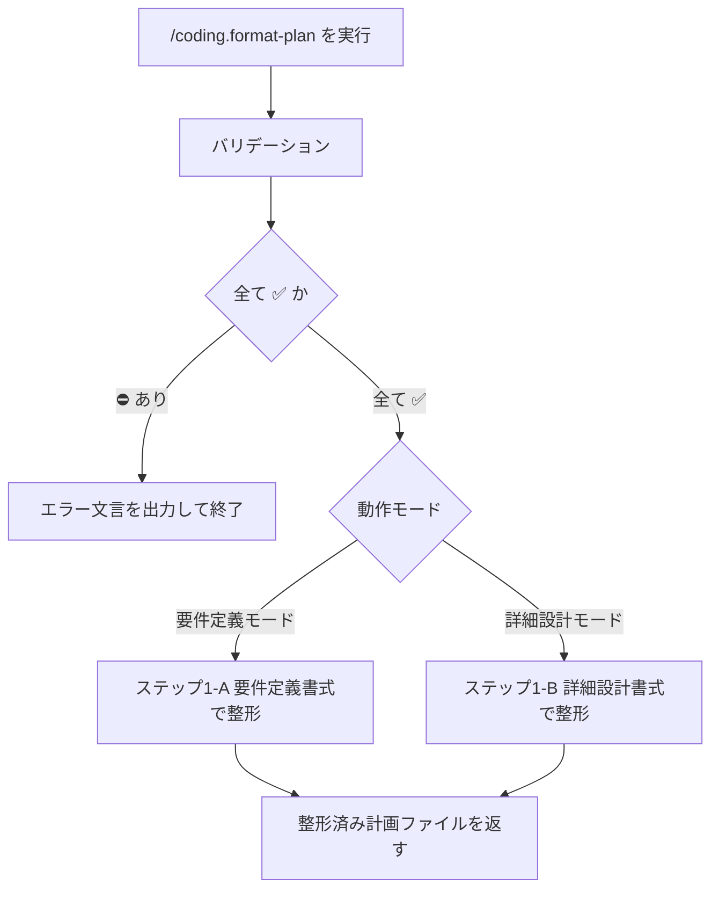

# 計画ファイル / 書式整形

## Help情報

`/coding.*` の補助コマンドである。
計画ファイルの内容を整理し、動作モードに応じた所定書式へ整えることで、レビュアーや実装者の読解負荷を下げる。

* 要件定義モードの正本: `{assets}/coding/requirements.md`
* 詳細設計モードの正本: `{assets}/coding/design.md`
* 要件・詳細設計・実装手順の中身を変えず、見出し・順序・表記・インデックスなどの書式のみを整える

### Example

```text
/coding.format-plan
```

```text
/coding.format-plan .ai-agent/plan/login-home.md
```

```text
/coding.format-plan .ai-agent/plan/login-home.md を要件定義モードで整形
```

```text
/coding.format-plan .ai-agent/plan/login-home.md を詳細設計モードで整形
```

## 関連ファイル

* `/coding.*`
* `/coding.requirement`
* `/coding.design`
* `{assets}/coding/requirements.md`
* `{assets}/coding/design.md`

## アセットディレクトリ

* `../assets/`
* `apm_modules/**/coding-xm3/.apm/assets/`

## 入力

### Required: 対象の計画ファイル

* 引数のパス・計画名、または文脈上の現行計画ファイル（`.ai-agent/plan/*.md`）から確定する
* 未指定・複数候補で特定不能・ファイルが存在しない場合は対話せずエラー終了する

#### 対象の計画ファイル: 入力値の例

* `.ai-agent/plan/login-home.md`
* `login-home`（`.ai-agent/plan/login-home.md` と一意に解釈できる場合）

### Required: 動作モード

* 引数または文脈（宣誓・直前の `/coding.requirement` / `/coding.design` など）から、次のいずれか一方に確定する
  * 要件定義モード
  * 詳細設計モード
* 択一で特定できない場合は対話せずエラー終了する

#### 動作モード: 入力値の例

* `要件定義モード`
* `詳細設計モード`
* `要件定義モードで整形`（引数フレーズから確定）

## 出力

### Required: 整形済み計画ファイル

* 入力と同じ計画ファイルを上書き更新する（新規作成しない）
* 成功条件:
  * 動作モードに対応する書式テンプレートに沿っている
  * 要件・詳細設計・実施内容に関わる意味情報が増減していない
  * 詳細設計モードでは、作業手順のインデックスが `ステップ1` から始まるよう最適化されている

#### 整形済み計画ファイル: 出力値の例

```markdown
対象ファイル: [login-home](.ai-agent/plan/login-home.md)
動作モード: 要件定義モード

計画ファイルを所定書式に整形しました。
```

## 手順



### バリデーション

入力:

| Label | 値 | バリデーション |
| --- | --- | --- |
| 対象の計画ファイル | {確定したパス、または空} | ✅️ |
| 動作モード | {要件定義モード / 詳細設計モード / 空} | ✅️ |

* 対象の計画ファイルが特定できない、または存在しない場合は `対象の計画ファイル` を ⛔️ とする
* 動作モードが要件定義モード／詳細設計モードのいずれかに確定できない場合は `動作モード` を ⛔️ とする
* 1つでも ⛔️ なら対話せず終了する

```markdown
対象の計画ファイル が不明確です。
コマンドを終了します。
```

または

```markdown
動作モード が不明確です。
コマンドを終了します。
```

### ステップ1-A: 要件定義書式で整形

動作モードが要件定義モードの場合に実施する。

* `{assets}/coding/requirements.md` を `workspace-resolve-file-path` で解決してからロードする
* 書式（見出し構成・必須セクションの有無・表記）に合わせて計画ファイルを整理し、上書き保存する
* 要件の意味内容・文言の意図は変更しない（言い換えによる意味変化も避ける）

### ステップ1-B: 詳細設計書式で整形

動作モードが詳細設計モードの場合に実施する。

* `{assets}/coding/design.md` を `workspace-resolve-file-path` で解決してからロードする
* 書式に合わせて計画ファイルを整理し、上書き保存する
* 作業手順は `ステップ1` から始まるようにインデックスを最適化する
* 実装内容・差分提案の意味は変更しない

## ガードレール

* ユーザーと対話して入力を補完しない。確認質問・選択肢提示・追加情報の依頼を行わない
* 入力・出力が不明確な場合は次の形式のみを返して終了する

```markdown
{XXXX} が不明確です。
コマンドを終了します。
```

* 書式整理のみを行う。要件・詳細設計・実施内容に関わる情報の追加・削除・意味変更を行わない
* 計画ファイル以外を変更しない
* 計画ファイルを新規作成しない（既存ファイルの上書きのみ）

## ナレッジベース

### DO: モードに対応する正本テンプレートだけを使う

* 要件定義モード → `{assets}/coding/requirements.md`
* 詳細設計モード → `{assets}/coding/design.md`

### DO: 詳細設計モードではステップ番号を振り直す

* 作業手順が途中番号や欠番になっている場合、`ステップ1` 起算に正規化する

### DO NOT: 書式整理のついでに要件や設計を厚くする

* 理由: 本コマンドの目的は読解負荷の低減であり、内容変更は `/coding.requirement` や `/coding.design` の役割である

### DO NOT: 動作モードを推測で決める

* 理由: 誤モードで整形するとセクション構成が壊れ、後続レビューが困難になるためである。文脈から一意に取れない場合はエラー終了する
