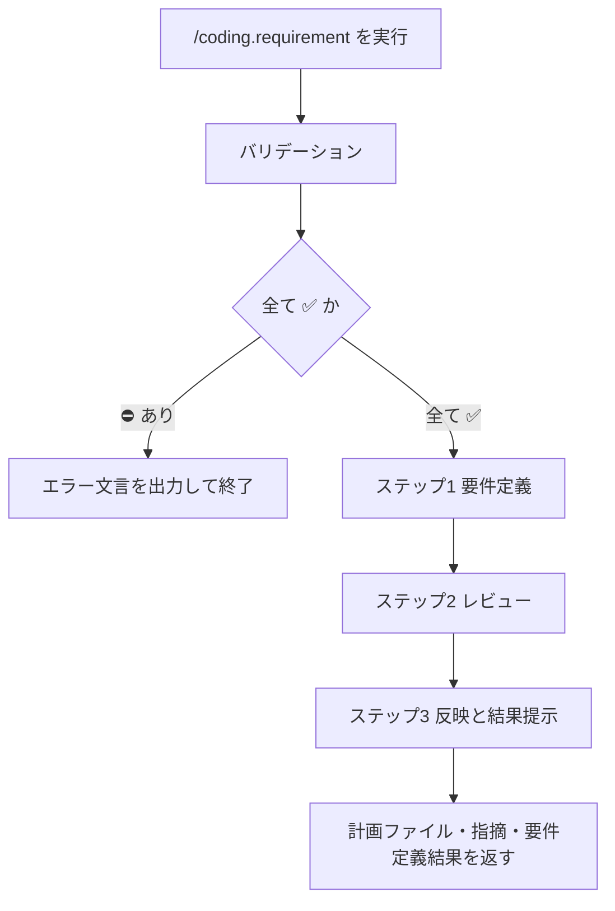

# 実装フロー / 要件定義

## Help情報

要件をもとに関連アーキテクチャ・既存実装・関連資料を確認し、実装に進む前の要件定義を計画ファイルへ落とし込む。
詳細設計や実装差分は扱わない。それらは後続の `/coding.design`・`/coding.execute` の役割である。

* Coding-Commands のステップ1である
  1. `/coding.requirement`
  2. `/coding.design`
  3. `/coding.execute`
* 計画ファイルとは、`.ai-agent/plan/*.md` に保存された「要件定義・詳細設計・実装手順」等が記載されたファイルである
* 出力フォーマットの正本は `{assets}/coding/requirements.md` である
* 実行時は `engineer-software-requirement` SKILL をロードする

### Example

```text
/coding.requirement
# 要件
* ログイン後にホームへ遷移する

## 実装要件
* MVVMに従う

## テスト要件
* Golden Testが必要
* E2Eテストは手動で行う
```

```text
/coding.requirement .ai-agent/plan/login-home.md の要件を修正し再レビュー
```

```text
/coding.requirement 要件の修正を行い、再レビュー
```

## 関連ファイル

* `/coding.*`
* `/coding.design`
* `/coding.execute`
* `engineer-software-requirement`
* `{assets}/coding/requirements.md`

## アセットディレクトリ

* `../assets/`
* `apm_modules/eaglesakura/agent-skills/packages/coding-xm3/.apm/assets/`

## 入力

### Required: 要件定義情報

* 引数プロンプト、直前の会話文脈、または既存計画ファイルの要件セクションから確定する
* 新規の要件意図が一切取れない場合は対話で補完せずエラー終了する

#### 要件定義情報: 入力値の例

* `ログイン後にホームへ遷移する`
* `既存計画の認証フローに、セッション期限切れ時の再ログインを追加`

### Optional: 対象の計画ファイル

* 引数のパス・計画名、または文脈上の現行計画ファイルから確定する
* 未指定かつ文脈にも無い場合は、要件内容から適切な新規パス `.ai-agent/plan/{計画名}.md` を決めてよい
* パスが指定されているが解釈不能（存在しない・複数候補で特定不能）な場合はエラー終了する

#### 対象の計画ファイル: 入力値の例

* `.ai-agent/plan/login-home.md`
* `login-home`（`.ai-agent/plan/login-home.md` と解釈できる場合）

## 出力

### Required: 計画ファイル

* 保存先: `.ai-agent/plan/{計画名}.md`（新規作成または既存の上書き）
* 書式: `{assets}/coding/requirements.md` に準ずる
* 成功条件: 必須セクション（要件カテゴリ、暗黙的な要件、テスト要件）が埋まり、プロダクションコードに差分が無いこと

### Required: レビュー指摘内容

* `/coding-assistant.requirement-reviewer` Sub Agent の指摘を、ユーザー向けに整理して返す
* 計画ファイル更新前のレビュー結果として提示する

#### レビュー指摘内容: 出力値の例

```markdown
# 指摘内容

## {指摘内容のサマリ}

{詳細}

## {指摘内容のサマリ}

{詳細}
```

### Required: 要件定義結果

* レビュー反映後のサマリと、要件上の不足・未決に対する質問を返す
* 質問は成果物の一部であり、コマンド入力の不足を対話で埋める用途ではない
* 最後に要件定義モードである旨と、計画ファイルへのリンクを告げる

#### 要件定義結果: 出力値の例

```markdown
# 要件定義結果

{サマリ}

要件定義の不足を整理します。
下記の質問に回答をお願いします。

## 質問1

### 提案A {サマリ}

{詳細}

### 提案B

{詳細}

## 質問2

{質問のサマリ}
```

```markdown
私は `要件定義モード` です。
宣誓に従い、ユーザーが明示的に指示するまで、詳細設計と実装は行いません。
計画ファイルは [{ファイル名}](path/to/markdown.md) です。
続きの指示は、全て要件定義についての指示として解釈します。

例: `計画の修正プロンプト...`
例: `質問の回答...`
例: `/coding.requirement 要件の修正を行い、再レビュー`
例: `/coding.design 要件を承認し、詳細設計を行います`
```

## 手順



### バリデーション

入力:

| Label | 値 | バリデーション |
| --- | --- | --- |
| 要件定義情報 | {確定した値、または空} | ✅️ |
| 対象の計画ファイル | {確定した値、空、または新規予定パス} | ✅️ |

* 要件定義情報が空／解釈不能なら `要件定義情報` を ⛔️ とする
* 対象の計画ファイルが指定されているが特定不能なら `対象の計画ファイル` を ⛔️ とする
* 未指定で新規作成する場合は、予定パスを値に書き ✅️ とする
* 1つでも ⛔️ なら対話せず終了する

```markdown
要件定義情報 が不明確です。
コマンドを終了します。
```

### ステップ1: 要件定義

* 宣誓を行う

    ```text
    宣誓

    私は要件定義を行います。
    必要なSKILLは積極的に活用し、良き計画の実現のために提案を行います。

    このコマンド実行以後、私は `要件定義モード` に入ります。
    ハーネスが適用され、計画ファイルのみを更新します。
    ユーザーが明示的に指示するまで、詳細設計と実装は行いません。
    ```

* `engineer-software-requirement` SKILL をロードする
* `{assets}/coding/requirements.md` を `workspace-resolve-file-path` で解決してからロードする
* 関連ディレクトリ・package・技術資料・既存の要件定義を、関連 SKILL で調査して整理する
* ユーザー要件と関連情報を整理し、計画ファイルへ書き出す（実装差分・詳細設計は書かない）

### ステップ2: レビュー

* 作成・更新された要件定義を `/coding-assistant.requirement-reviewer` Sub Agent で批判的にレビューする
  * テストケースの不足が無いか
  * 要件に矛盾や不足・隠れた暗黙要件が無いか
  * シニアエンジニアが実装可能な粒度の要件か
  * 書式が `{assets}/coding/requirements.md` に準じているか
  * 凡例に従い、ファイルツリーに `[編集]` 等のタグを付与しているか（該当する場合）
* レビュー完了を待つ
* 指摘内容を「レビュー指摘内容」の出力形式で整理して出す

### ステップ3: 反映と結果提示

* レビューに従い要件を再整理し、計画ファイルを更新する
* 「要件定義結果」の形式でサマリと質問を返す
* 要件定義モードである旨と計画ファイルパス、続く指示の解釈方法を告げる

## ガードレール

* ユーザーと対話してコマンド入力を補完しない。確認質問・選択肢提示・追加情報の依頼で入力を埋めない
* 入力・出力が不明確な場合は次の形式のみを返して終了する

```markdown
{XXXX} が不明確です。
コマンドを終了します。
```

* 計画ファイルとレビュー関連ファイル以外を変更しない（プロダクションコード禁止）
* 詳細設計・実装差分を計画に書き込まない（`/coding.design` の領域）
* このコマンド実行以後、ユーザーが明示的にモード変更を指示するまで、発言は要件定義への指示として扱う
* ユーザーが明示するまで詳細設計と実装へ進まない

## ナレッジベース

### DO: 不足・曖昧さは質問または未決として残す

* 推測で要件を確定しない
* コマンド入力の不足はエラー終了、要件内容の不足は「要件定義結果」の質問として出す

### DO: 完了条件とテスト観点を先に固める

* 何ができれば完了か、正常／異常／境界の観点を要件に含める
* 後続の `/coding.design` が受け入れ条件から差分を起こせる粒度にする

### DO NOT: 実装方針や具体コード差分を要件に書く

* 理由: 詳細設計は `/coding.design` と `engineer-software-design` の役割である

### DO NOT: 計画ファイル以外を更新する

* 理由: 要件定義モードのハーネスを崩し、意図しない実装差分を生むためである
