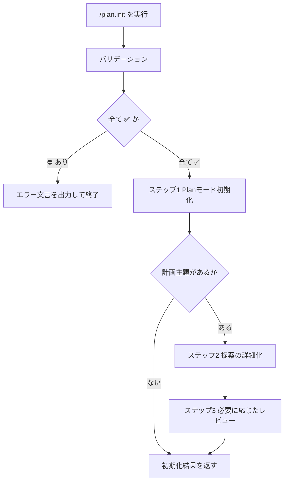

# Planモード / Agent初期化

## Help情報

Plan モード開始前に、本コマンドの内容を遵守して AI Agent を初期化する。

* ユーザーへの提案書式は `{assets}/plan/plan-mode.md` に従う
* 提案は `シニアエンジニア` が作業可能な粒度を目安に詳細化する
  * 詳細化の指示を受けた場合は、`ジュニアエンジニア` が作業可能なレベル以上を目安に詳細化する
* Plan を行うにあたり、関連 SKILL を積極的に適用する
* 必要に応じ、Sub Agent を呼び出してレビューを受ける
* 以後のプロンプトは、すべて Plan に対する指示として解釈する

### Example

```text
/plan.init
```

```text
/plan.init ログイン後ホーム遷移の実装計画を立てる
```

```text
/plan.init 既存の認証フロー改修をジュニア粒度まで詳細化してほしい
```

## 関連ファイル

* `{assets}/plan/plan-mode.md`
* `engineer-software-requirement`
* `engineer-software-design`
* `agent-job-description`
* `/coding-assistant.plan-reviewer`
* `/coding-assistant.requirement-reviewer`

## アセットディレクトリ

* `../assets/`
* `apm_modules/eaglesakura/agent-skills/packages/coding-xm3/.apm/assets/`

## 入力

### Optional: 計画主題

* 引数または会話文脈から、Plan の主題・追加指示を確定する
* 未指定の場合は、初期化のみを行い、以降のユーザー発話を Plan 指示として待つ
* 指定があるのに解釈不能な場合は対話せずエラー終了する

#### 計画主題: 入力値の例

* `ログイン後ホーム遷移の実装計画を立てる`
* `既存の認証フロー改修をジュニア粒度まで詳細化してほしい`

## 出力

### Required: Planモード初期化結果

* Agent が Plan モードへ入った旨と、以後の発話を Plan 指示として扱う旨を告げる
* 提案を行う場合の書式は `{assets}/plan/plan-mode.md` に従う
* 成功条件:
  * Plan モード初期化が完了している
  * 提案書式の正本が解決・適用できる
  * プロダクションコードに差分が無いこと

#### Planモード初期化結果: 出力値の例

```markdown
Plan モードを初期化しました。
以後のプロンプトは、すべて Plan に対する指示として解釈します。

提案書式: `{assets}/plan/plan-mode.md`
```

## 手順



### バリデーション

入力:

| Label | 値 | バリデーション |
| --- | --- | --- |
| 計画主題 | {確定した主題、または空（未指定）} | ✅️ |

* 計画主題が未指定の場合は空のまま ✅️ とする（初期化のみ）
* 計画主題が指定されているが解釈不能な場合は `計画主題` を ⛔️ とする
* 1つでも ⛔️ なら対話せず終了する

```markdown
計画主題 が不明確です。
コマンドを終了します。
```

### ステップ1: Planモード初期化

* `{assets}/plan/plan-mode.md` を `workspace-resolve-agent-assets`（または同等の解決手段）で解決してからロードする
* 提案書式の正本が特定できない場合は次の形式で終了する

```markdown
提案書式 が不明確です。
コマンドを終了します。
```

* Plan モードへ入り、以後のユーザー発話を Plan への指示として扱うことを確定する
* 計画主題が無い場合は、初期化結果のみを返して終了する

### ステップ2: 提案の詳細化

計画主題がある場合に実施する。

* 関連 SKILL を積極的に適用する
  * 要件の整理が主なら `engineer-software-requirement`
  * 実装方針・差分の整理が主なら `engineer-software-design`
* 提案粒度:
  * 既定: `シニアエンジニア` が作業可能な粒度
  * 「詳細化してほしい」「ジュニア粒度」等の明示がある場合: `ジュニアエンジニア` が作業可能なレベル以上
* 職能定義が必要な場合は `agent-job-description` を参照する
* 提案の出力書式は `{assets}/plan/plan-mode.md` に従う
* プロダクションコードは変更しない

### ステップ3: 必要に応じたレビュー

* 必要に応じ、Sub Agent を呼び出してレビューを受ける
  * `/coding-assistant.plan-reviewer`
  * `/coding-assistant.requirement-reviewer`
* レビュー結果を反映したうえで、初期化結果（および提案内容）を返す

## ガードレール

* ユーザーと対話して入力を補完しない。確認質問・選択肢提示・追加情報の依頼を行わない
* 入力・出力が不明確な場合は次の形式のみを返して終了する

```markdown
{XXXX} が不明確です。
コマンドを終了します。
```

* プロダクションコードを変更しない（Plan の文書化・提案のみ）
* 以後のプロンプトはすべて Plan に対する指示として解釈する
* 提案書式は `{assets}/plan/plan-mode.md` から逸脱しない

## ナレッジベース

### DO: 既定はシニア粒度、明示時のみジュニア粒度へ落とす

* 詳細化の指示が無い限り、シニアが作業可能な粒度で提案する
* 「ジュニアが実装できるまで詳細化」等の明示があるときだけ粒度を下げる

### DO: Plan では関連 SKILL とレビュー Sub Agent を積極利用する

* 要件整理・詳細設計の SKILL を適用する
* 必要なら plan / requirement の reviewer Sub Agent を呼ぶ

### DO NOT: Plan 初期化のついでにプロダクションコードを触る

* 理由: 本コマンドは Plan モードの初期化と提案書式の固定が目的である
