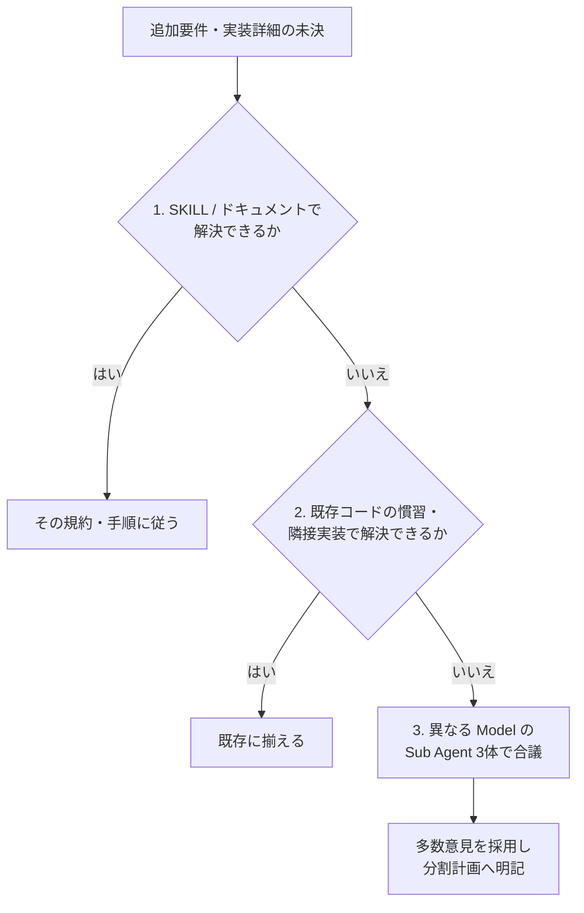
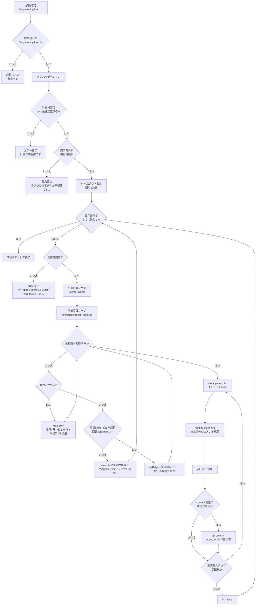

# Coding / ループエンジニアリング

要件定義済み計画を起点に、**完了条件を満たすまで** 詳細設計ループと `/coding.execute`（各ステップ後は必ず `/coding.comment`）を自律反復する。
Coding-Commands のステップ2〜3を外側ループで束ねる。ステップ1（`/coding.requirement`）は前提として完了済みであること。
正本はこの SKILL のみ（同名 Prompt は置かない）。

詳細設計は slash-command に委譲せず、`references/design-loop.md` に従って本 SKILL 内で実施する。
本 SKILL 実行中は「ユーザー承認待ち」で止まらず、ゲート（`_review.md` の全指摘が `対応済み`・完了条件・タイムアウト）に従って execute / 次ループへ進む。
詳細設計ループが指摘の一部を親へ渡した場合は、本 SKILL が上位として対応判断（採用＝`再レビュー待ち`／不採用＝`不採用`）を行い、Review Agent の確認で `対応済み` にするまで execute へ進まない。
通常レビューと DO NOT 監査は同一の `{stem}_review.md` を先行閲覧し横断重複しない。通常レビュー観点は cascade（最初にヒットした 1 段だけ。全視点総ざらい禁止）。
Status 凡例は `references/review-template.md` 正本（`要対応` / `再レビュー待ち` / `不採用` / `対応済み`）。確認レビューは必要 Agent のみ。同一 `{stem}_{N}` のレビュー起動は最大 3 回（内側の発散防止）。
要件定義済み計画を進める過程で、**追加の要件・実装詳細・解釈の分岐**が出た場合は、次節の優先度に従って解決する（推測のまま進めない）。

## 未決の追加要件・実装詳細の解決優先度

適用対象: ループ中（分割計画の用意・詳細設計・レビュー・execute）に現れた、計画に足りない追加要件や実装詳細。
適用しない: 完了条件そのものが不明な場合（事前チェックの緊急停止）、および `/coding.requirement` のやり直し。

次の順で試し、上で決まれば下へ進まない。



### 1. SKILL およびドキュメントに従う

* 本 SKILL、`references/design-loop.md`、`references/engineer-software-design.md`、`agent-job-description`
* リポジトリの `docs/`、レイヤー規約、Coding-Commands 関連文書、関連 SKILL の DO / DO NOT
* ここで一意に決まるなら、その決定を分割計画に書いて続行する

### 2. 既存コードに従う

* 同レイヤー・隣接 feature・同種の既存実装・テストの書き方を正とする
* 「プロジェクトで既にやっているやり方」を優先し、新規パターンを発明しない
* 根拠となるファイルパスを分割計画に残す

### 3. 異なる Model の Sub Agent 3体で合議する

1 と 2 で決まらないときだけ行う。詳細設計ループ／`/coding.execute` の通常レビュー経路とは別の、**未決解消用**の例外である。

1. 未決点・制約・候補を短く整理した同一プロンプトで、**互いに異なる model** の Sub Agent を **3つ並列**起動する
   * model はセッションで利用可能なスラッグから選ぶ（例: 異なる提供元・系統を混ぜる）
   * 3体とも同じ model にしない
2. 各 Agent に、結論・根拠・却下した案を返させる（実装差分の本番適用はさせない。助言のみ）
3. 親 Agent が合議する
   * 2体以上が一致 → その案を採用
   * 3者ばらばら → 既存コードへの影響が小さい案、またはドキュメントに近い案を選び、却下理由を計画に残す
4. 採用結果を `{stem}_{N}.md` に明記してから詳細設計 / execute を続ける
5. 合議でも完了条件自体が割れ、検証不能になった場合のみ緊急停止（完了条件不明）する

## 呼び出し形式（必須）

```text
/loop /coding.loop {要件定義済み計画} {完了条件・任意のタイムアウト等}
```

* `/loop` が先、続けて SKILL 名 `coding.loop`
* skill 単独や形式不一致では **起動しない**

## いつ使うか / 使わないか

使う:

* `/loop /coding.loop …` で始まる指示のみ

使わない:

* skill 単独の呼び出し（`/loop` 無し）
* 単発の詳細設計のみ・`/coding.execute` のみ
* `/coding.requirement` 未完了、または要件計画が無い
* 完了条件がプロンプトにも計画にも無い（→ 事前チェックで緊急停止）
* Coding-Commands 外の `/loop`（例: ライブラリ更新だけ）

## アセットディレクトリ

* `../../assets/`
* `apm_modules/**/coding-xm3/.apm/assets/`

## 関連コマンド / SKILL / Agent

本 SKILL は次を使う。

* `/coding.requirement`（前提。本ループでは実行しない）
* **詳細設計ループ**（本 SKILL 内。`references/design-loop.md` 正本。slash-command は使わない）
* `/coding.execute`（実装。1ステップずつ）
* `/coding.comment`（各 execute 直後のコメント充足。省略不可）
* `agent-job-description`
* `{assets}/coding.execute/work-orders.md`
* Cursor `/loop`（必須接頭辞、かつタイムアウト監視の武装）

例外: 「未決の追加要件・実装詳細の解決優先度」の **第3段（合議）** のみ、親から Sub Agent を直接・並列起動してよい。

## 詳細設計ループ（references）

内側の詳細設計・レビューは次をロードして実施する（必要なときだけ読む）。

| ファイル | 役割 |
| --- | --- |
| `references/design-loop.md` | 詳細設計〜レビュー〜改善の手順正本 |
| `references/engineer-software-design.md` | 設計粒度・品質基準 |
| `references/design-template.md` | 計画ファイルの出力フォーマット |
| `references/review-template.md` | 指摘一覧（`{stem}_review.md`）の出力フォーマット |

## 入力

### Required: 要件定義済み計画ファイル

* `.ai-agent/plan/{name}.md`（`/coding.requirement` 済み）
* 引数・文脈から一意に特定。不能ならエラー終了

### Required: 完了条件（ゴール）

次のいずれかから **検証可能な完了条件** を確定する。推測で埋めない。

* ユーザープロンプトの完了条件
* 計画の要件・テスト要件・受け入れ条件

不明なら事前チェックで緊急停止する。

### Optional: タイムアウト

* 指定例: `60分` / `90m`
* 未指定時の既定: **120分**

### Optional: 作業範囲ヒント

* 残作業の優先・除外。未指定なら計画の未完了分全体

## 出力

### Required: 分割計画ファイル群

* `.ai-agent/plan/{要件定義ファイルの stem}_{N}.md`
* 例: `login-home.md` → `login-home_1.md`, `login-home_2.md`, …

### Required: レビュー指摘ファイル

* `.ai-agent/plan/{stem}_{N}_review.md`（計画と対）
* 書式: `references/review-template.md`
* Status は `references/review-template.md` の凡例に従う（`要対応` / `再レビュー待ち` / `不採用` / `対応済み`）
* 全指摘が `対応済み` になるまで内側ゲートを通過しない

### Required: 実装差分とステップ単位 commit

* `/coding.execute` によるプロダクション変更
* 各実装ステップ直後の `/coding.comment` によるコメント充足
* 各実装ステップ後の `git commit`（差分がある場合。execute + comment をまとめる）

### Required: 終了サマリ

* 成功 / タイムアウト / 事前チェック失敗を明示
* 実施した外側ループ番号・残課題を短く返す

## 処理フロー



要点:

1. 初回は詳細設計ループ（既定＝詳細設計＋1回分のレビュー経路。`references/design-loop.md`）。新規指摘は `要対応`。計画へ反映した指摘は `再レビュー待ち`
2. `要対応` は Main が処分する。DO NOT は必ず採用（`再レビュー待ち`）。その他は採用（`再レビュー待ち`）または不採用（`不採用`）
3. `再レビュー待ち` / `不採用` は Review Agent の確認で `対応済み`（または未解消なら `要対応` へ戻す）。確認は必要 Agent のみ。同一 `{stem}_{N}` のレビュー起動は最大 3 回
4. execute は **1ステップ → `/coding.comment` → diff →（あれば）commit** を計画の全ステップ分繰り返す（comment は差分の有無にかかわらず必ず実施）
5. 外側は完了条件未達かつタイムアウト前のあいだ 2〜4 を繰り返す

## 緊急停止メッセージ（固定文言）

### 完了条件不明

```markdown
タスクの完了条件が不明確です。
実装ループを緊急停止します。
```

### タイムアウト

```markdown
完了条件を規定時間で満たせませんでした。
実装ループを緊急停止します。
```

## 手順

### ステップ0: バリデーションと事前チェック

1. 呼び出しが `/loop /coding.loop` 形式か確認する。違えば処理に入らない
2. 要件定義済み計画を特定する。不能なら「計画が不明確」で終了する
3. 完了条件を確定する。不能なら **完了条件不明** 文言のみ出して終了する
4. タイムアウトを決める（既定 120分 = 7200秒）
5. `/loop` に従い、デッドライン wake を **1本だけ** 武装する（例: `AGENT_LOOP_WAKE_codingloop`）
6. 開始時刻・デッドライン・要件計画・完了条件・`N=1` を作業メモに残す

対話で入力を補完しない。不明ならエラー／緊急停止で止める。

### ステップ1: 外側ループの継続判定

各外側イテレーションの先頭で、この順に判定する。

1. **タイムアウト**: デッドライン到達 → タイムアウト文言で緊急停止
2. **完了**: 完了条件を証拠付きで満たす → 成功サマリで終了
3. どちらでもなければステップ2へ

完了判定は、受け入れ条件・テスト・チェックリスト等の証拠で行う。「だいたいできた」で閉じない。

### ステップ2: 分割計画の用意

1. パス: `.ai-agent/plan/{stem}_{N}.md`（stem は拡張子なし）
2. 無ければ新規作成し、要件側セクションを要件計画から引き継ぐ（空ファイルのまま詳細設計に渡さない）
3. 対となる `.ai-agent/plan/{stem}_{N}_review.md` を用意する（無ければ `references/review-template.md` から作成）
4. 残作業があれば、前回の未完了・失敗・新規差分を作業範囲として明記する

詳細設計ループは「既存ファイル上書きのみ」である。本 SKILL が分割ファイルと `_review.md` を先に作ることで両立する。

### ステップ3: 詳細設計ループ（既定）

1. 対象 `{stem}_{N}.md` に対し、`references/design-loop.md` に従って詳細設計ループを実施する（作業指示は既定＝詳細設計、レビュー起動モードは `フル`、イテレーション 1）
2. 同手順内で `references/engineer-software-design.md`・`references/design-template.md`・`references/review-template.md` をロードする
3. 通常レビューと DO NOT 監査には同一の `{stem}_{N}_review.md` を渡し、先行閲覧・横断重複禁止・cascade（通常レビュー）を守らせる
4. プロダクションコードは変更しない
5. 作業メモに「当該 `{stem}_{N}` のレビュー起動回数 = 1」を記録する（ステップ2で作った `_review.md` 用意はレビュー起動に数えない）

既定の詳細設計ループはレビューと 1 回分の改善まで含む。計画へ反映した指摘は `再レビュー待ち` になる。終了時点で未完了 Status（`要対応` / `再レビュー待ち` / `不採用`）が残っていればステップ4へ進む。すべて `対応済み` ならステップ4をスキップしてステップ5へ進んでよい。

### ステップ4: 内側ループ（Main 処分 → Review 確認）

詳細設計ループは指摘を `_review.md` に残しうる。本 SKILL はその上位として、**全指摘が `対応済み` になるまで execute しない**。通常のレビュー Sub Agent は詳細設計ループ（`references/design-loop.md`）に任せ、本 SKILL から直起動しない（合議例外は未決解消の第3段のみ）。

Status 凡例（正本は `references/review-template.md`）:

| Status | 意味 |
| --- | --- |
| `要対応` | Review Agent が要対応と診断した（Main の処分待ち） |
| `再レビュー待ち` | Main が計画へ反映した（Review の確認待ち） |
| `不採用` | Main が採用しないと決定した（Review の確認待ち） |
| `対応済み` | Main / Review 双方が対応（または不採用）を承認済み |

#### 4.1 指摘の収集

`{stem}_{N}_review.md` から未完了（`対応済み` 以外）を列挙する。0 件ならステップ5へ。

#### 4.2 Main 処分（`要対応` のみ）

| 種別 | 判断 | 対応 |
| --- | --- | --- |
| DO NOT | **不採用不可**。必ず採用 | 計画を修正し、Status を `再レビュー待ち` にする |
| その他 | **全部または一部を採用** | 採用した範囲を計画へ反映し、Status を `再レビュー待ち` にする |
| その他 | **不採用** | Status を `不採用` にし、同エントリに不採用理由を書く |

* 一部採用した場合、残った部分も同じ指摘単位で採用か不採用かを決め、`要対応` のまま残さない
* 「保留のまま次へ」は本 SKILL では禁止
* 未決の実装詳細が処分に必要なら、先に「未決の追加要件・実装詳細の解決優先度」で埋めてから処分する
* 計画ファイルへの「レビュー否認ログ」節は使わない（正本は `_review.md`）
* Main 単独で `対応済み` にしない（Review 確認が必要）

同一指摘が再び `要対応` に戻ってきた場合は、既存 `不採用` 理由がなお妥当なら再度 `不採用` にしてよい。妥当でなければ採用して `再レビュー待ち` にする。

処分後の記録:

* `pending_confirm`: `再レビュー待ち` または `不採用` が1件以上あるか
* `touched_sources`: 確認対象の出典（`通常レビュー` / `DO NOT監査` / 両方）

#### 4.3 Review 確認とゲート

`要対応` が残っているあいだは 4.2 を先に行う。

**確認レビューを起動する条件**（すべて満たすとき）:

1. `pending_confirm` が true（`再レビュー待ち` または `不採用` がある）
2. 当該 `{stem}_{N}` のレビュー起動回数 < 3

満たさない場合:

* すべて `対応済み` → ゲート通過（ステップ5へ）
* レビュー起動回数が既に 3 で未完了が残る → execute せず残課題をメモし、外側の完了／タイムアウト判定へ戻る（Main 単独で `対応済み` にしない）

確認レビューを起動する場合:

```text
レビュー起動モードを選ぶ:
  touched_sources が DO NOT監査のみ → DO NOTのみ
  touched_sources が 通常レビューのみ → 通常のみ
  両方 → フル
  （確認目的である旨をプロンプトに「確認のみ／差分検証」と明示）

references/design-loop.md に従い、作業指示「レビューのみ」、
レビュー起動モードとイテレーション番号（現行+1）を渡して実施する
レビュー起動回数を +1 する

返却を Status に反映:
  再レビュー待ち が解消 → 対応済み
  再レビュー待ち が未解消 → 要対応
  不採用 を Review が承認 → 対応済み
  不採用 を Review が不当と判断 → 要対応
  新規は要対応 として追記（中/低は破棄）
```

内側の疑似コード:

```text
while 未完了 Status（要対応 / 再レビュー待ち / 不採用）が1件以上:
  if 要対応 がある:
    4.2 で全件処分する
    continue
  if レビュー起動回数 >= 3:
    break  // execute せず外側判定へ
  上記の確認レビューを1回行う
```

内側ゲート（すべて満たしてからステップ5へ）:

1. `_review.md` の全指摘が `Status: 対応済み`（または指摘ゼロ）

* 内側の収束より外側のタイムアウト判定が優先される
* 「レビューのみ」は詳細設計の書き直し（design-loop のステップ1）をスキップする。大幅な作り直しが必要なら外側で `N` を進め新しい分割計画を切る
* `不採用` のままゲート通過しない（Review が承認して `対応済み` にするまで待つ）
* 初回フルレビューを毎回転すのは禁止。確認は差分検証＋必要 Agent のみ

### ステップ5: 実装（1ステップごと + comment + commit）

対象は同じ `{stem}_{N}.md`。**全ステップを一度に execute しない**。

各実装ステップについて:

1. `/coding.execute {stem}_{N}.md` で **当該ステップのみ** を実施する（例: `ステップ3のみ`）
2. ジュニア →（失敗時）シニア引き継ぎ → 品質確認の順を守る
3. Formatter / Analyzer を省略しない
4. 計画チェックリストを更新する
5. **必ず** `/coding.comment` でコメント充足する（省略・スキップ不可）
   * 対象スコープは当該ステップで触ったプロダクションコード（変更ファイル・新規シンボル・編集した関数／型など）。テスト専用ファイルのみの変更でも、コメント規約の対象なら同様に実施する
   * 操作方針は既定のまま（追加・更新のみ。削除しない）でよい
   * execute 側の品質フォローアップでコメントに触れていても、本ステップの `/coding.comment` は省略しない（ループ側のゲートとして独立させる）
   * コメント変更が不要と判断できる場合でもコマンドを実行し、規約に照らして確認したうえで「変更なし」でよい
6. 差分確認と自動 commit（execute + comment の結果をまとめて）
   * `git status` と `git diff` で当該ステップの変更を確認する
   * 対象があれば関連パスを stage し、作業内容に沿ったメッセージで `git commit` する
   * メッセージは HEREDOC。計画ステップ名や要点を含め、なぜ・何をしたかが分かる 1〜2 文にする
   * 差分が無ければ commit しない
   * secrets は stage しない。`git push` / `--amend` / `--force` / hooks スキップはしない

```bash
git add <当該ステップの関連パス>
git commit -m "$(cat <<'EOF'
{作業内容に基づくメッセージ}

EOF
)"
```

未実施ステップが残っていれば本ステップの先頭へ戻る。全て終わったらステップ6へ。

### ステップ6: ループ更新

1. `N ← N + 1`
2. ステップ1へ戻る

## タイムアウトと `/loop`

* 完了駆動が主。時計は安全弁
* デッドライン wake で必ずタイムアウト文言を出す
* 外側の合間にも経過時間を見て、超過なら同じ文言で止める（wake 待ちだけに依存しない）
* 成功・緊急停止のどちらでも監視プロセスを止め、再武装しない

## ガードレール

* `/loop /coding.loop` 以外で起動しない（skill 単独不可）
* 本ループ内で `/coding.requirement` をやり直さない（要件不足なら緊急停止）
* 完了条件を推測で補完しない（未決は「解決優先度」1→2→3で埋める。それでも完了条件が検証不能なら緊急停止）
* `_review.md` に未完了 Status（`要対応` / `再レビュー待ち` / `不採用`）があるまま execute しない
* DO NOT 抵触を `不採用` で逃げない（必ず採用して `再レビュー待ち` → Review 確認で `対応済み`）
* 詳細設計ループからの親渡し指摘を「ユーザー待ち」や「後で」にせず、本 SKILL で採用／不採用を決める
* 通常レビューと DO NOT 監査は同一 `_review.md` を閲覧し、横断で重複指摘させない
* 通常レビュー観点は cascade の 1 段だけ（全視点総ざらい禁止）
* Main 単独で `対応済み` にしない（Review 確認が必要）
* 確認レビューで不要な側の Sub Agent を起動しない（出典に応じて `通常のみ` / `DO NOTのみ`）
* 同一 `{stem}_{N}` のレビュー起動を 3 回超えて回さない
* execute のまとめ実行・`/coding.comment` 省略・commit 省略をしない（1ステップ → comment → diff → commit）
* 計画外の大規模リファクタへ広げない
* タイムアウト後に続行しない
* 自動 commit を `git push` まで拡張しない
* 合議（優先度3）を、ドキュメントや既存コードで既に決まる論点には使わない

## ナレッジベース

### DO: 完了条件を先に固定し、毎ループ証拠で判定する

停止条件が曖昧だとループが発散する。テスト・チェックリスト・成果物で検証する。

### DO: 外側ループごとに計画ファイルを分割する

`{stem}_{N}.md` と対の `{stem}_{N}_review.md` で設計履歴・指摘履歴と execute 対象を一致させる。

### DO: 未決は ドキュメント → 既存コード → 3 Model 合議 の順で決める

上で決まれば下へ進まない。合議は最終手段であり、採用結果は分割計画に残す。

### DO: 内側ゲートは「`_review.md` の全指摘が対応済み」である

`要対応` / `再レビュー待ち` / `不採用` を残したまま execute しない。未決解消の合議とレビュー処分を混同しない。

### DO: 確認レビューは必要 Agent だけで、差分／不採用妥当性に絞る

採用後は `再レビュー待ち`、却下後は `不採用`。いずれも Review 確認で初めて `対応済み`。同一 N で最大 3 回。軽微指摘の再発火で内側を伸ばさない。

### DO: execute は1ステップごとに `/coding.comment` → diff → commit する

コメント不足のまま次ステップへ進むと、後から一括で直すコストとレビュー負荷が増える。execute 直後に充足し、同じ commit に含める。まとめて commit すると切り戻しとレビューが難しい。空 commit は作らない。

### DO NOT: 要件未完了のまま開始する

詳細設計 / execute の前提が崩れ、誤実装かゴール不明の緊急停止になる。

### DO NOT: 「ユーザー承認待ち」や未完了 Status 放置で外側を止める

本 SKILL のゲートは `_review.md` の全指摘 `対応済み`・完了条件・タイムアウト・ユーザー明示停止である。毎回の人間承認や親渡し指摘の放置を外側の待機条件にしない。

### DO NOT: 処分のたびに初回フルレビューを繰り返す／Main 単独で対応済みにする

不要 Agent の再起動、および確認レビューでの `中`/`低` 新規の追記は、内側ループの発散とコスト増になる。`対応済み` は双方承認のみ。

### DO NOT: 合議で完了条件を後付けしない

優先度3は実装詳細・解釈の分岐用である。完了条件が無い・割れきった状態を合議で取り繕わない。

### DO NOT: タイムアウト既定を無視して走り続ける

自律ループはコストと破壊半径が大きい。既定 120分は安全上限である。
