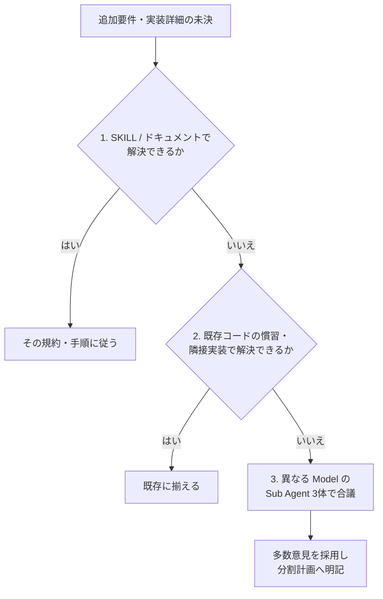
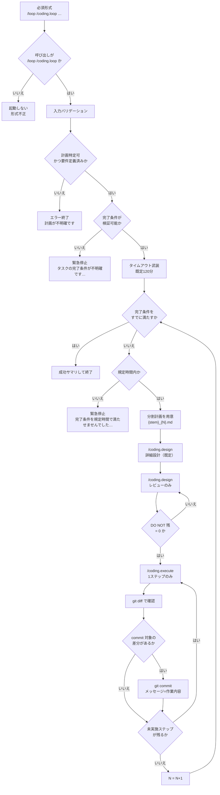

# Coding / ループエンジニアリング

要件定義済み計画を起点に、**完了条件を満たすまで** `/coding.design` と `/coding.execute` を自律反復する。
Coding-Commands のステップ2〜3を外側ループで束ねる。ステップ1（`/coding.requirement`）は前提として完了済みであること。
正本はこの SKILL のみ（同名 Prompt は置かない）。

本 SKILL 実行中は、単発 `/coding.design` 末尾の「ユーザー承認待ち」で止まらず、ゲート（DO NOT 残ゼロ・完了条件・タイムアウト）に従って execute / 次ループへ進む。

要件定義済み計画を進める過程で、**追加の要件・実装詳細・解釈の分岐**が出た場合は、次節の優先度に従って解決する（推測のまま進めない）。

## 未決の追加要件・実装詳細の解決優先度

適用対象: ループ中（分割計画の用意・design・レビュー・execute）に現れた、計画に足りない追加要件や実装詳細。
適用しない: 完了条件そのものが不明な場合（事前チェックの緊急停止）、および `/coding.requirement` のやり直し。

次の順で試し、上で決まれば下へ進まない。



### 1. SKILL およびドキュメントに従う

* 本 SKILL、`engineer-software-design`、`agent-job-description`、`{assets}/coding/*`
* リポジトリの `docs/`、レイヤー規約、Coding-Commands 関連文書、関連 SKILL の DO / DO NOT
* ここで一意に決まるなら、その決定を分割計画に書いて続行する

### 2. 既存コードに従う

* 同レイヤー・隣接 feature・同種の既存実装・テストの書き方を正とする
* 「プロジェクトで既にやっているやり方」を優先し、新規パターンを発明しない
* 根拠となるファイルパスを分割計画に残す

### 3. 異なる Model の Sub Agent 3体で合議する

1 と 2 で決まらないときだけ行う。`/coding.design` / `/coding.execute` の通常レビュー経路とは別の、**未決解消用**の例外である。

1. 未決点・制約・候補を短く整理した同一プロンプトで、**互いに異なる model** の Sub Agent を **3つ並列**起動する
   * model はセッションで利用可能なスラッグから選ぶ（例: 異なる提供元・系統を混ぜる）
   * 3体とも同じ model にしない
2. 各 Agent に、結論・根拠・却下した案を返させる（実装差分の本番適用はさせない。助言のみ）
3. 親 Agent が合議する
   * 2体以上が一致 → その案を採用
   * 3者ばらばら → 既存コードへの影響が小さい案、またはドキュメントに近い案を選び、却下理由を計画に残す
4. 採用結果を `{stem}_{N}.md` に明記してから design / execute を続ける
5. 合議でも完了条件自体が割れ、検証不能になった場合のみ緊急停止（完了条件不明）する

## 呼び出し形式（必須）

```text
/loop /coding.loop {要件定義済み計画} {完了条件・任意のタイムアウト等}
```

* `/loop` が先、続けて SKILL 名 `coding.loop`
* skill 単独や形式不一致では **起動しない**

## いつ使うか / 使わないか

使う:

* `/loop /coding.loop …` で始まる指示のみ

使わない:

* skill 単独の呼び出し（`/loop` 無し）
* 単発の `/coding.design` / `/coding.execute`
* `/coding.requirement` 未完了、または要件計画が無い
* 完了条件がプロンプトにも計画にも無い（→ 事前チェックで緊急停止）
* Coding-Commands 外の `/loop`（例: ライブラリ更新だけ）

## アセットディレクトリ

* `../../assets/`
* `apm_modules/**/coding-xm3/.apm/assets/`

## 関連コマンド / SKILL / Agent

本 SKILL は次を **コマンド経路経由** で使うのが原則である（design / execute / レビューは `/coding.design`・`/coding.execute` に任せる）。

* `/coding.requirement`（前提。本ループでは実行しない）
* `/coding.design`（詳細設計 / `レビューのみ`。対象は分割計画）
* `/coding.execute`（実装。1ステップずつ）
* `engineer-software-design` / `agent-job-description` / `{assets}/coding/design.md`
* `{assets}/coding.execute/work-orders.md`
* Cursor `/loop`（必須接頭辞、かつタイムアウト監視の武装）

例外: 「未決の追加要件・実装詳細の解決優先度」の **第3段（合議）** のみ、親から Sub Agent を直接・並列起動してよい。

## 入力

### Required: 要件定義済み計画ファイル

* `.ai-agent/plan/{name}.md`（`/coding.requirement` 済み）
* 引数・文脈から一意に特定。不能ならエラー終了

### Required: 完了条件（ゴール）

次のいずれかから **検証可能な完了条件** を確定する。推測で埋めない。

* ユーザープロンプトの完了条件
* 計画の要件・テスト要件・受け入れ条件

不明なら事前チェックで緊急停止する。

### Optional: タイムアウト

* 指定例: `60分` / `90m`
* 未指定時の既定: **120分**

### Optional: 作業範囲ヒント

* 残作業の優先・除外。未指定なら計画の未完了分全体

## 出力

### Required: 分割計画ファイル群

* `.ai-agent/plan/{要件定義ファイルの stem}_{N}.md`
* 例: `login-home.md` → `login-home_1.md`, `login-home_2.md`, …

### Required: 実装差分とステップ単位 commit

* `/coding.execute` によるプロダクション変更
* 各実装ステップ後の `git commit`（差分がある場合）

### Required: 終了サマリ

* 成功 / タイムアウト / 事前チェック失敗を明示
* 実施した外側ループ番号・残課題を短く返す

## 処理フロー



要点:

1. 初回は `/coding.design`（既定＝詳細設計＋1回分のレビュー経路）
2. その後 DO NOT 残が 0 になるまで **`/coding.design … レビューのみ`** のみ再実行（大規模な設計作り直しは外側で `{stem}_{N+1}` を切る）
3. execute は **1ステップ → diff →（あれば）commit** を計画の全ステップ分繰り返す
4. 外側は完了条件未達かつタイムアウト前のあいだ 2〜3 を繰り返す

## 緊急停止メッセージ（固定文言）

### 完了条件不明

```markdown
タスクの完了条件が不明確です。
実装ループを緊急停止します。
```

### タイムアウト

```markdown
完了条件を規定時間で満たせませんでした。
実装ループを緊急停止します。
```

## 手順

### ステップ0: バリデーションと事前チェック

1. 呼び出しが `/loop /coding.loop` 形式か確認する。違えば処理に入らない
2. 要件定義済み計画を特定する。不能なら「計画が不明確」で終了する
3. 完了条件を確定する。不能なら **完了条件不明** 文言のみ出して終了する
4. タイムアウトを決める（既定 120分 = 7200秒）
5. `/loop` に従い、デッドライン wake を **1本だけ** 武装する（例: `AGENT_LOOP_WAKE_codingloop`）
6. 開始時刻・デッドライン・要件計画・完了条件・`N=1` を作業メモに残す

対話で入力を補完しない。不明ならエラー／緊急停止で止める。

### ステップ1: 外側ループの継続判定

各外側イテレーションの先頭で、この順に判定する。

1. **タイムアウト**: デッドライン到達 → タイムアウト文言で緊急停止
2. **完了**: 完了条件を証拠付きで満たす → 成功サマリで終了
3. どちらでもなければステップ2へ

完了判定は、受け入れ条件・テスト・チェックリスト等の証拠で行う。「だいたいできた」で閉じない。

### ステップ2: 分割計画の用意

1. パス: `.ai-agent/plan/{stem}_{N}.md`（stem は拡張子なし）
2. 無ければ新規作成し、要件側セクションを要件計画から引き継ぐ（空ファイルのまま design に渡さない）
3. 残作業があれば、前回の未完了・失敗・新規差分を作業範囲として明記する

`/coding.design` 単体は「既存ファイル上書きのみ」である。本 SKILL が分割ファイルを先に作ることで両立する。

### ステップ3: 詳細設計（`/coding.design` 既定）

1. 対象 `{stem}_{N}.md` に対し `/coding.design`（作業指示は既定＝詳細設計）を実施する
2. `engineer-software-design` と `{assets}/coding/design.md` に従う
3. プロダクションコードは変更しない

既定の `/coding.design` はレビューまで含む。終了時点で DO NOT 残が残っていればステップ4へ進む。既に 0 ならステップ4をスキップしてステップ5へ進んでよい。

### ステップ4: 内側ループ（`/coding.design` レビューのみ）

DO NOT 残が 1 以上のあいだ、**レビューのみ** を繰り返す。通常のレビュー Sub Agent は `/coding.design` に任せ、本 SKILL から直起動しない（合議例外は未決解消の第3段のみ）。

```text
do {
  /coding.design {stem}_{N}.md レビューのみ
} while (DO NOT 監査の残件数 >= 1)
```

* 残 0 になるまで execute しない
* 内側の収束より外側のタイムアウト判定が優先される
* 「レビューのみ」は詳細設計の書き直し（design のステップ1）をスキップする。大幅な作り直しが必要なら外側で `N` を進め新しい分割計画を切る

### ステップ5: 実装（1ステップごと + commit）

対象は同じ `{stem}_{N}.md`。**全ステップを一度に execute しない**。

各実装ステップについて:

1. `/coding.execute {stem}_{N}.md` で **当該ステップのみ** を実施する（例: `ステップ3のみ`）
2. ジュニア →（失敗時）シニア引き継ぎ → 品質確認の順を守る
3. Formatter / Analyzer を省略しない
4. 計画チェックリストを更新する
5. 差分確認と自動 commit
   * `git status` と `git diff` で当該ステップの変更を確認する
   * 対象があれば関連パスを stage し、作業内容に沿ったメッセージで `git commit` する
   * メッセージは HEREDOC。計画ステップ名や要点を含め、なぜ・何をしたかが分かる 1〜2 文にする
   * 差分が無ければ commit しない
   * secrets は stage しない。`git push` / `--amend` / `--force` / hooks スキップはしない

```bash
git add <当該ステップの関連パス>
git commit -m "$(cat <<'EOF'
{作業内容に基づくメッセージ}

EOF
)"
```

未実施ステップが残っていれば本ステップの先頭へ戻る。全て終わったらステップ6へ。

### ステップ6: ループ更新

1. `N ← N + 1`
2. ステップ1へ戻る

## タイムアウトと `/loop`

* 完了駆動が主。時計は安全弁
* デッドライン wake で必ずタイムアウト文言を出す
* 外側の合間にも経過時間を見て、超過なら同じ文言で止める（wake 待ちだけに依存しない）
* 成功・緊急停止のどちらでも監視プロセスを止め、再武装しない

## ガードレール

* `/loop /coding.loop` 以外で起動しない（skill 単独不可）
* 本ループ内で `/coding.requirement` をやり直さない（要件不足なら緊急停止）
* 完了条件を推測で補完しない（未決は「解決優先度」1→2→3で埋める。それでも完了条件が検証不能なら緊急停止）
* DO NOT 残があるまま execute しない
* execute のまとめ実行や commit 省略をしない（1ステップ → diff → commit）
* 計画外の大規模リファクタへ広げない
* タイムアウト後に続行しない
* 自動 commit を `git push` まで拡張しない
* 合議（優先度3）を、ドキュメントや既存コードで既に決まる論点には使わない

## ナレッジベース

### DO: 完了条件を先に固定し、毎ループ証拠で判定する

停止条件が曖昧だとループが発散する。テスト・チェックリスト・成果物で検証する。

### DO: 外側ループごとに計画ファイルを分割する

`{stem}_{N}.md` で設計履歴と execute 対象を一致させる。

### DO: 未決は ドキュメント → 既存コード → 3 Model 合議 の順で決める

上で決まれば下へ進まない。合議は最終手段であり、採用結果は分割計画に残す。

### DO: 内側の品質ゲートは「レビューのみ」に寄せる

DO NOT 残の解消は `/coding.design … レビューのみ` に任せる。未決解消の合議と混同しない。

### DO: execute は1ステップごとに diff して commit する

まとめて commit すると切り戻しとレビューが難しい。空 commit は作らない。

### DO NOT: 要件未完了のまま開始する

design / execute の前提が崩れ、誤実装かゴール不明の緊急停止になる。

### DO NOT: 単発 design の「ユーザー承認待ち」で外側を止める

本 SKILL のゲートは DO NOT 残ゼロ・完了条件・タイムアウト・ユーザー明示停止である。毎回の人間承認を外側の待機条件にしない。

### DO NOT: 合議で完了条件を後付けしない

優先度3は実装詳細・解釈の分岐用である。完了条件が無い・割れきった状態を合議で取り繕わない。

### DO NOT: タイムアウト既定を無視して走り続ける

自律ループはコストと破壊半径が大きい。既定 120分は安全上限である。
