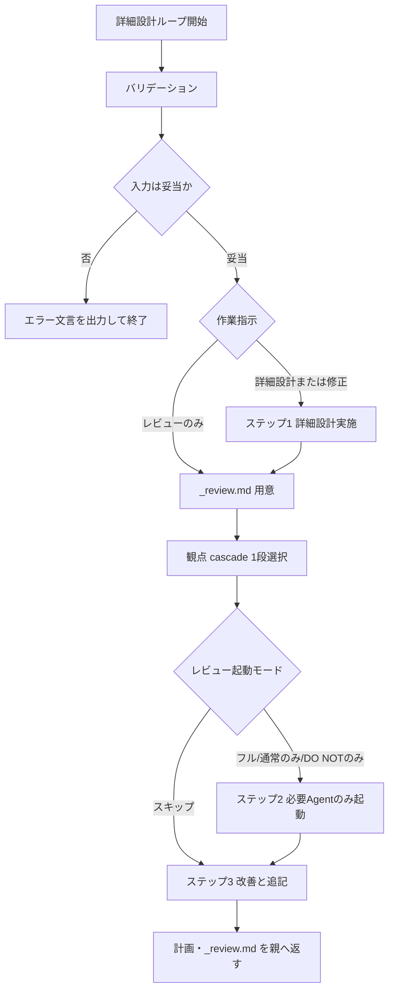

# 詳細設計ループ

`coding.loop` 内側の詳細設計・レビュー手順の正本である。
外部の詳細設計 slash-command は呼ばない。本ドキュメントと隣接 references だけで完結させる。

本手順における詳細設計とは、**ジュニアエンジニアが実装可能なレベルでの具体的な実装を文書化すること**である。

## いつ読むか

* `coding.loop` のステップ3（詳細設計）およびステップ4（再レビュー）の直前
* 作業指示が「詳細設計（既定）」「修正して再レビュー」「レビューのみ」のいずれか

## 隣接 references（必須ロード）

| ファイル | 役割 |
| --- | --- |
| `references/engineer-software-design.md` | 設計粒度・手順・品質基準 |
| `references/design-template.md` | 計画ファイルの出力フォーマット |
| `references/review-template.md` | 指摘一覧（`{stem}_review.md`）の出力フォーマット |

職能粒度は同一 package の `agent-job-description` を参照する。

## 入力

### Required: 対象の計画ファイル

* 既存の分割計画（例: `.ai-agent/plan/{stem}_{N}.md`）を上書きする。新規作成はしない（分割ファイルの用意は親 `coding.loop` の責務）
* 未特定・不在なら対話せずエラー終了する

### Optional: 作業指示

* 未指定なら「詳細設計を行い、レビューまで進める」
* 解釈例:
  * 詳細設計（新規更新）→ ステップ1 から実施（レビューは初回フル）
  * レビューのみ → ステップ1 をスキップし、ステップ2 から実施（親が指定したモードに従う）
  * 修正して再レビュー → ステップ1 で指摘反映・再設計し、ステップ2 以降へ進む（再レビューは差分検証）

### Optional: レビュー起動モード（親が明示）

親 `coding.loop` が渡す。未指定なら「フル（通常レビュー＋DO NOT 監査の並列）」。

| モード | 起動する Sub Agent | いつ使うか |
| --- | --- | --- |
| `フル` | 通常レビュー ＋ DO NOT 監査（並列） | 当該 `{stem}_{N}` の初回レビュー |
| `通常のみ` | 通常レビューのみ | 計画差分が通常レビュー由来の反映だけの再検証 |
| `DO NOTのみ` | DO NOT 監査のみ | 計画差分が DO NOT 反映だけの再検証 |
| `確認のみ` | 出典に応じて通常／DO NOT／両方 | `再レビュー待ち` の確認（差分検証のみ） |
| `スキップ` | 起動しない | すべて `対応済み` のときのみ（親がゲート判定） |

再レビュー（イテレーション ≥ 2）では、親が上記のうち必要なものだけを指定する。両方必要なときだけ `フル` に戻す。

## 出力

### Required: 計画ファイル

* 入力と同じ計画ファイルを上書き更新する
* 書式: `references/design-template.md` に準ずる
* 成功条件:
  * ジュニアが作業可能な具体差分・ファイルツリー・実装手順が含まれている
  * プロダクションコードに差分が無いこと

### Required: レビュー指摘ファイル

* パス: 計画と同一ディレクトリの `{計画ファイル stem}_review.md`
  * 例: `login-home_1.md` → `login-home_1_review.md`
* 書式: `references/review-template.md` に準ずる（Status 凡例の正本）
* Sub Agent の新規指摘を追記する（書き込みは親のみ。Status 初期値は `要対応`）
* 会話内だけの指摘一覧は正本にしない

## 手順



### バリデーション

* 対象計画が特定できない／存在しない → 終了

```markdown
対象の計画ファイル が不明確です。
詳細設計ループを終了します。
```

* 作業指示が矛盾・解釈不能 → 終了
* 作業指示未指定 → 「詳細設計（既定）」として続行

### ステップ1: 詳細設計実施

作業指示が「レビューのみ」の場合は本ステップをスキップし、ステップ2へ進む。

* 既存計画（特に要件）を確認する
* `references/engineer-software-design.md` をロードする
* `references/design-template.md` をロードする
* `agent-job-description` からジュニアの技能定義と提案粒度を確定する
* 次の cascade で最初にヒットした 1 段だけを設計基準にし、具体的な実装を提案する（下位段へは降りない。総ざらい禁止）

```text
if プロンプトに特別な指示がある:
  その指示を優先して設計する
elif プロジェクト docs に適用可能な指示がある:
  docs の指示を優先して設計する
elif 既存・関連コードの慣習が特定できる:
  その慣習をもとに設計する
elif 公式推奨パターンが特定できる:
  公式推奨をもとに設計する
elif コミュニティ推奨が特定できる:
  コミュニティ推奨をもとに設計する
else:
  一般的なコーディングパターンで設計する
```

* ジュニアが実装可能な具体的差分であること
* 要件が抽象的すぎて差分を書けない場合は推測で埋めず終了する

```markdown
要件XXXX が不明確です。
詳細設計ループを終了します。
```

プロダクションコードは変更しない。

### ステップ2: 実装計画のレビュー

#### 2.0 `_review.md` の用意

* `{計画 stem}_review.md` が無ければ `references/review-template.md` から作成し、対象計画パスを記入する
* あれば現状は変えず、以降の追記・Status 更新に使う

#### 2.1 通常レビュー観点の cascade（全視点総ざらい禁止）

上から順に「使える指示があるか」を判定し、**最初にヒットした 1 段だけ**を通常レビューの基準にする。下位段へは降りない。1〜6 を同時に総ざらいしない。

```text
if プロンプトに特別な指示がある:
  その指示を優先してレビューする
elif プロジェクト docs に適用可能な指示がある:
  docs の指示を優先してレビューする
elif 既存・関連コードの慣習が特定できる:
  その慣習をもとにレビューする
elif 公式推奨パターンが特定できる:
  公式推奨をもとにレビューする
elif コミュニティ推奨が特定できる:
  コミュニティ推奨をもとにレビューする
else:
  一般的なコーディングパターンでレビューする
```

* セキュリティおよびコーディングの一般的アンチパターンの確認は cascade とは **別枠**（常に実施してよい）
* 親は選んだ cascade 段を Sub Agent プロンプトに明示する（例: `今回の基準: プロジェクト docs`）

#### 2.2 Sub Agent 起動（通常レビューと DO NOT 監査は同一 `_review.md`）

* 親から渡された **レビュー起動モード** に従い起動する（`スキップ` なら本ステップを終了しステップ3へ）
* 起動する Agent のプロンプトに必ず含める:
  * 計画パス
  * `_review.md` パス（同一ファイル）
  * 「指摘作業の**前に** `_review.md` を読め。Status 凡例に従え。`対応済み` は再指摘禁止。`再レビュー待ち` は解消確認（差分検証）のみ述べ、新規エントリを増やさない。新規診断は `要対応` 相当として親が追記する内容だけ返せ」
  * イテレーション番号（当該 `{stem}_{N}` での何回目のレビュー起動か）
* 通常レビュー側にのみ追加: 選んだ cascade 段（1 段だけ）
* **確認・再レビュー（イテレーション ≥ 2、またはモード `確認のみ`）** のとき追加（起動する Agent すべて）:
  * 「モード: 差分検証。`再レビュー待ち` の解消だけを述べる」
  * 「新規指摘は推奨度 `必須` / `高`、または DO NOT 抵触のみ。`中` / `低` の新規は出さない」
* DO NOT 監査プロンプト例:

  ```markdown
  # DO NOT 監査

  * `docs/` および `{skill}/references/` の `DO NOT` 見出しと、詳細設計を突合してください。
  * 監査の前に次の指摘ファイルを読み、既存指摘と重複する内容は返さないでください: [{review名}]({path/to/plan_review.md})
  * 監査結果を定型フォーマットで親Agentに伝えてください。
  * イテレーション: {n}（2以上／確認のみなら差分検証。新規は DO NOT 抵触のみ）

  計画ファイル: [{計画名}]({path/to/plan.md})
  指摘ファイル: [{review名}]({path/to/plan_review.md})
  ```

* 起動したレビューの完了を待つ（起動しなかった Agent は待たない）
* 返却を親が Status に反映する（Review Agent はファイルを直接書かない）
  * 新規診断 → `_review.md` に `Status: 要対応` で追記
  * `再レビュー待ち` が解消済みとの報告 → `対応済み`
  * `再レビュー待ち` が未解消 → `要対応` に戻す
  * 初回（イテレーション 1）のみ: `コメント不足` など非破壊的で悪影響のない指摘は推奨度「必須」としてよい
  * 再レビューで返ってきた `中` / `低` の新規は破棄する（追記しない）

### ステップ3: 詳細設計の改善

* 新規指摘を `_review.md` に `Status: 要対応` で追記する（イテレーション番号、推奨度、出典 Agent）
* 指摘をセルフレビューし、次の基準で計画へ反映する。反映したら Status を **`再レビュー待ち`** にする（`対応済み` にはしない。Review 確認前）
  * 2人以上のレビュアーが指摘 → 反映する
  * 「具体性が足りない」旨の指摘 → 反映する
  * 内容を判断し適切と考える指摘 → 反映する
  * DO NOT 監査結果 → 反映する
  * その他は **親 `coding.loop` の処分ルールへ渡す**（`要対応` のまま残す。親が採用＝`再レビュー待ち`／不採用＝`対応済み`＋「提案を不採用とした」記録 を決める）
* 終了時に `要対応` / `再レビュー待ち` が残っていれば親のステップ4へ渡る。すべて `対応済み`（または指摘ゼロ）なら親はステップ4をスキップできる
* 計画ファイルへ「レビュー否認ログ」は書かない（不採用理由は `_review.md` の当該エントリに「提案を不採用とした: {理由}」として書く）

## ガードレール

* ユーザーと対話して入力を補完しない
* 計画は新規作成せず、既存ファイルを上書きする
* 計画ファイルと `_review.md`（およびレビュー関連）以外を変更しない（プロダクションコード禁止）
* 実装差分を省略せず、レビュー可能な詳細度を保つ
* 「ユーザー承認待ち」で止まらない。停止判断は親 `coding.loop` のゲートに任せる
* 通常レビュー観点は cascade の 1 段だけ。全視点総ざらいをしない
* 通常レビューと DO NOT 監査は同一 `_review.md` を先行閲覧し、横断で重複指摘しない
* レビュー起動モードが `スキップ` / `通常のみ` / `DO NOTのみ` / `確認のみ` のとき、不要な Sub Agent を起動しない
* 再レビューで `中` / `低` の新規指摘を `_review.md` に追記しない
* 計画へ反映した指摘を `要対応` のまま残さない（反映後は `再レビュー待ち`）。採用経路では Main 単独で `対応済み` にしない（不採用処分は親が直接 `対応済み` にしてよい）

## ナレッジベース

### DO: ジュニアが写経・手順実行できる粒度で書く

ファイルツリー、具体差分（または同等の完全手順）、テスト、ステップ・バイ・ステップ手順を揃える。

### DO: レビュー指摘の反映基準を守る

複数レビュアー一致・具体性不足・DO NOT は必ず反映する。それ以外の未処理は `_review.md` 上で親へ明示する。

### DO: 指摘の正本は `_review.md` にする

会話内 Markdown だけの指摘一覧に頼らない。Status 凡例（要対応／再レビュー待ち／対応済み）に従う。

### DO: 採用は `再レビュー待ち`→双方承認の `対応済み`、不採用は Main が理由付きで `対応済み`

採用は Main の反映後、Review の差分確認を経て初めて `対応済み`。不採用は親が本文に「提案を不採用とした」＋理由を残して直接 `対応済み`。確認は差分と必要 Agent に絞る。

### DO NOT: 要件が不足したまま詳細設計を進める

差分が書けない状態で推測すると、後続の `/coding.execute` で手戻りが大きくなる。

### DO NOT: 計画と `_review.md` 以外を更新する

詳細設計のハーネスを崩し、意図しない実装差分を生む。

### DO NOT: 通常レビューで cascade 全段を同時に見る

上位段が使えるなら下位は使わない。総ざらいはコストとノイズになる。

### DO NOT: 再レビューを初回フルレビューと同じ広さで繰り返す

軽微指摘の再発火が内側ループを伸ばす。差分検証と推奨度フィルタで止める。
