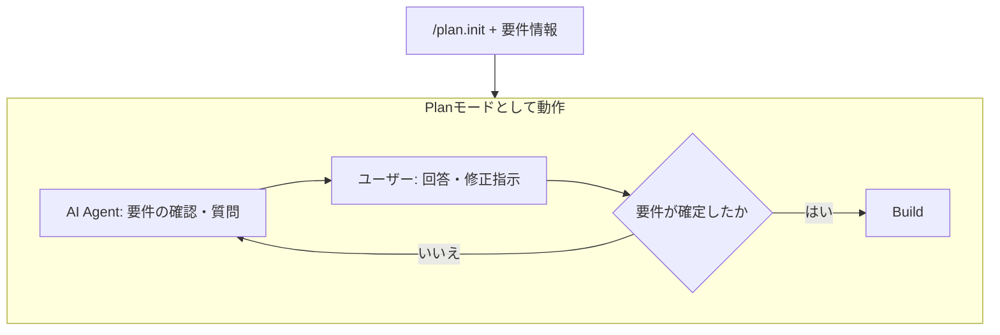
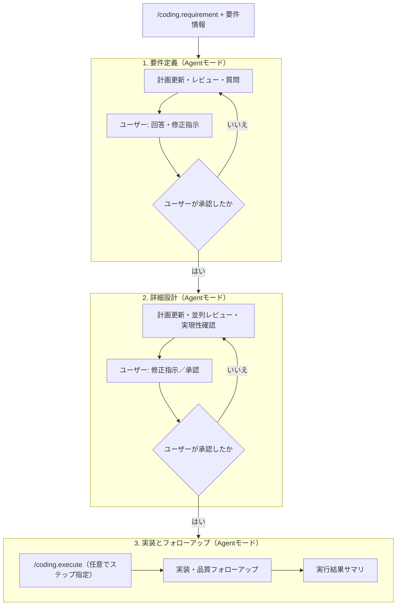

# coding-xm3

開発フローを最適化し、AI Agentが確実に開発を行うためのSKILL/Command/Sub Agentを提供する。

Coding-Commands（要件 → 詳細設計 → 実施）と関連 Sub Agent / SKILL / 共有アセットである。
`plan.init`・コメント適正化も含む。`armyknife`（`markdown-search` / `workspace-agent-temporary` 等）に依存する。

メインの 3 ステップ（要件 → 詳細設計 → 実施）の手順は [coding-command](docs/coding-command.md) を参照する。

## Quick Start

```yaml
dependencies:
  apm:
    - eaglesakura/agent-skills/packages/armyknife
    - eaglesakura/agent-skills/packages/coding-xm3
```

## ユースケース

### 小規模タスク

* `/plan.init` + Planモードを使用する



* 推奨するタスク規模
  * クラスリネーム + コメント追従等、IDE機能を代替するタスク
  * メソッド / クラス単位の実装
  * 単一レイヤー内の実装
  * 5ファイル以内の編集
  * 参考実装が存在する・テンプレートが存在する場合の実装タスク

### 中規模タスク もしくは AI Agentの詳細な制御を行いたい場合

1. `/coding.requirement` + Agentモードで要件定義
    * プロンプトとして、次の内容を与えると精度が上がる（例）
      * 対象のpackage/module/アーキテクチャレイヤー等、AI Agentの作業スコープを小さくできる要素
      * 対象画面デザイン
      * （存在するならば）既存コード
      * 参考実装
    * 実行すると、計画ファイルが1つ作成される
      * 要件が確定するまで、AI Agentと対話して改善を繰り返す
2. `/coding.design` + Agentモードで詳細設計
    * 実行すると、計画ファイルに具体的なコード差分が提案される
    * 問題のある設計や具体実装がないか等、実装前に十分に検討する
    * 要件の間違いが見つかったら、 `/coding.requirement` に戻って要件定義をやり直す
3. `/coding.execute` + Agentモードで実装とフォローアップ
    * 詳細設計時に実装順が提案されるため、細かく区切りながら実装させることが可能
    * 実行すると、計画ファイルを元に差分が実装される



詳細なシーケンスは [coding-command](docs/coding-command.md) を参照する。

* 推奨するタスク規模
  * 実装内容を事前に制御したい場合
  * 複数クラス・レイヤーにまたがる実装
  * 5ファイルを超える範囲の実装
  * 抽象的な要件の実装
  * 参考実装がない場合の実装

---

## SKILLS

※ `.apm/skills/` 配下（アルファベット順）。

### agent-job-description

* ジュニア／シニア等の職能ごとの技能範囲を定義し、依頼内容をその前提に合わせる。
* 「ジュニアエンジニアが作業可能」などレベル指定時に、許容される作業・避けるべき抽象度を揃える。
* 計画書・コードコメントの粒度など、職能に応じた要件を SKILL 本文で規定する。

### engineer-software-design

* 要件を満たす詳細設計を行い、変更内容を提案する。実装計画（プランニング）時はロードすることが前提となる。
* **コード変更は行わず**、要件確認・関連ドキュメント調査・設計出力に特化する。
* コードレビュー用途の SKILL と併用することが望ましい。

### engineer-software-requirement

* 要件定義に特化し、適切な要件定義ドキュメントの出力を行う。
* **コード変更は行わず**、`{assets}/coding/requirements.md` に沿って整理する。
* 完了条件・前提・テスト観点・影響範囲などを SKILL の手順で確認する。

## Commands

※ `.apm/prompts/` が正本（アルファベット順）。

### coding.comment

* 指定スコープのコードコメント粒度をプロジェクト方針に合わせて適正化する。
* 言語に応じた SKILL・ドキュメントをロードし、コメントは原則として追記のみとし、関連コードとコメントの整合を確認する。
* Internal / Private でも Public と同等のコメント基準とし、関数・メソッドには言語の記法に沿った example を含める。

```text
/coding.comment path/to/user_service.go
```

```text
/coding.comment path/to/preference_key.dart の PreferenceKey
```

```text
/coding.comment 選択中の FetchUser 関数
```

```text
/coding.comment path/to/user_service.go を追加のみでコメント適正化
```

### coding.design

* Coding-Commands のステップ 2 である（`/coding.requirement` → `/coding.design` → `/coding.execute`）。
* 要件を踏まえアーキテクチャを確認し、ジュニアエンジニアが実装可能な粒度の詳細設計を計画ファイルへ反映する。
* 出力フォーマットは `{assets}/coding/design.md` に準ずる。計画ファイルは `.ai-agent/plan/*.md` を上書き保存する。

```text
/coding.design
```

```text
/coding.design

XXXXの箇所をYYYYに変更する
```

```text
/coding.design

全体整合性の確認と反映後に再レビュー
```

### coding.execute

* Coding-Commands のステップ 3 である。事前に構築された計画に基づき実装を反映する。
* 計画ファイルと作業範囲を読み、`coding-assistant.junior-engineer` 等の Sub Agent へテンプレートに沿った指示を渡す手順を規定する。

```text
/coding.execute
```

```text
/coding.execute すべてのステップを実行してください
```

```text
/coding.execute ステップ3まで完了させてください
```

### coding.format-plan

* `/coding.*` 用の補助コマンド。対象の計画ファイルを `{assets}/coding/requirements.md` または `{assets}/coding/design.md` の書式に沿って整理し、レビュアー・実装者の読解負荷を下げる。
* ガードレールとして、書式整理のみとし、要件・詳細設計・実施内容の意味を変えない。
* 詳細設計モードでは作業手順を `ステップ1` から始まるようインデックスを整える。

```text
/coding.format-plan
```

```text
/coding.format-plan .ai-agent/plan/login-home.md
```

### coding.requirement

* Coding-Commands のステップ 1 である。
* 要件の初期案から実装計画を `.ai-agent/plan/{計画名}.md` に保存する。出力フォーマットは `{assets}/coding/requirements.md` に準ずる。
* ガードレールとして、計画・レビュー関連ファイル以外の変更を行わない要件定義モードを規定する。

```text
/coding.requirement

# 要件

* ホーム画面を実装する
* ログインしていない場合は、ログイン画面に遷移する
```

```text
/coding.requirement 

質問への返答
1. A
2. B
3. XXXXです
```

```text
/coding.requirement 

XXXXをYYYYに変更
```

```text
/coding.requirement 再レビュー
```

### plan.init

* Plan モード開始前に Agent の初期化ルールを適用する。ユーザーへの提案書式は `{assets}/plan/plan-mode.md` に従う。
* 計画の粒度はシニアエンジニアが作業可能な水準を目安とし、詳細化指示時はジュニアエンジニアが扱えるレベルまで落とす。
* 積極的に SKILL（例: `engineer-software-requirement`・`engineer-software-design`）と Sub Agent レビュー（例: `coding-assistant.plan-reviewer`・`coding-assistant.requirement-reviewer`）を利用する。

```text
/plan.init
```

```text
/plan.init ログイン後ホーム遷移の実装計画を立てる
```

```text
/plan.init 既存の認証フロー改修をジュニア粒度まで詳細化してほしい
```

## Sub Agents

※ `.apm/agents/` が正本（アルファベット順）。

### coding-assistant.junior-engineer

* ジュニアエンジニア職能として、与えられた実装計画から逸脱しない範囲で実装を行う。
* `engineer-software-design` と `{assets}/coding/design.md` を参照する。
* 計画確認・宣誓・中断時は親 Agent へ報告する。

### coding-assistant.plan-reviewer

* ジュニアエンジニア職能の前提で、実装計画の実現性可否を判断する（`readonly`・バックグラウンド実行想定）。
* `agent-job-description` 等の職能定義と照らし、計画逸脱なく実行可能かをチェックリスト形式で親 Agent に返す。

### coding-assistant.requirement-reviewer

* 要件定義のレビュアー。不足・不明瞭な要件の洗い出しと判断材料の提示を行う（`readonly`・バックグラウンド実行想定）。
* `engineer-software-requirement` と `{assets}/coding/requirements.md` を参照する。

### coding-assistant.senior-engineer

* シニアエンジニア職能として、要件達成に必要な最小限の計画逸脱を認めつつ計画範囲内で自律的にコーディングする。
* `engineer-software-design` と `{assets}/coding/design.md` を参照する。

### coding-assistant.software-design-audit

* 詳細設計・実装の監査役。`markdown-search` で根拠を集め、シニア職能の物差しで評価する。
* `agent-job-description`・`engineer-software-design`・`{assets}/coding/design.md` を参照する。

### coding-assistant.software-design-reviewer

* 詳細設計ドキュメントや実装のレビュアー。指摘は要約せず一覧で親 Agent に渡す（`readonly`・バックグラウンド実行想定）。
* `engineer-software-design` と `{assets}/coding/design.md` を参照する。

## 補助ファイル（テンプレート）

Slash Command または SKILL から `{assets}/...` で参照する。正本は `.apm/assets/`。解決は `workspace-resolve-agent-assets`（`armyknife`）に従う。

| ファイル | 参照元の例 |
| --- | --- |
| [assets/coding/design.md](.apm/assets/coding/design.md) | `/coding.design`、詳細設計レビュー・ジュニア／シニア Engineer Agent |
| [assets/coding/requirements.md](.apm/assets/coding/requirements.md) | `/coding.requirement`、要件レビュアー、`engineer-software-requirement` |
| [assets/coding.execute/work-orders.md](.apm/assets/coding.execute/work-orders.md) | `/coding.execute` |
| [assets/plan/plan-mode.md](.apm/assets/plan/plan-mode.md) | `/plan.init` |
