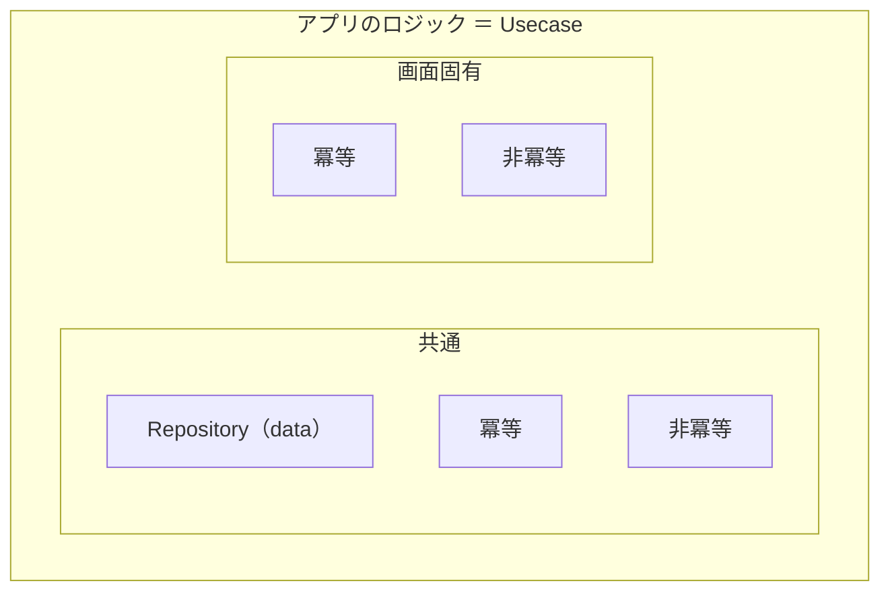

# Flutter-Layered-Architecture / 設計

モノリスを `dart workspace` で分割し、**上位が下位に依存する**複数レイヤーで責務を分離する。
テスタビリティと保守性のため、レイヤー境界と DI を守る。

詳細は文脈に応じて `references/` を追加ロードする（本 SKILL は地図と原則）。

## いつ使うか

* 機能をどのレイヤー／package プレフィックスに置くか決めるとき
* 依存方向・DI（interface / impl / Riverpod）の設計判断
* 「処理は Usecase」「データ抽象は Repository（data）」の整理
* 詳細設計・実装の前にアーキテクチャ前提を揃えるとき

## いつ使わないか

* Usecase / Repository の Request&Result 等の **実装パターン詳細** → `flutter-layered-architecture-design-patterns`
* 画面の MVVM 実装手順 → `flutter-layered-architecture-screen-mvvm`
* 既存コードの所在調査 → `flutter-layered-architecture-code-search`
* Dart のコーディング規約だけ → `flutter-coding-rules`
* レイヤー非依存の汎用詳細設計ドキュメント化だけ → `engineer.software-design`（必要なら本 SKILL を併用）

## 作業手順

1. 要求がどのレイヤー責務かを、下表で特定する
2. 依存は **上位 → 下位** のみ（同レベルでも循環クラス参照を作らない）
3. package は interface と実装を分け、Riverpod で結ぶ
4. 細部が必要なら該当 `references/` を読む

## レイヤー一覧

| レイヤー名 | package 名プレフィックス | レベル | 役割 |
| --- | --- | --- | --- |
| app | `app` | 7 | アプリケーション起動・DI 統合 |
| screen | `screen_*` | 6 | 各画面（MVVM） |
| view | `view_*` | 5 | 再利用 UI（Widget 等） |
| usecase | `usecase_*` | 4 | ビジネスロジック |
| data | `data_*` | 4 | データ Read/Write（Repository 等） |
| infra | `infra_*` | 3 | OS／実機差の吸収 |
| domain | `domain_*` | 2 | アプリドメイン |
| foundation | `foundation_*` | 1 | DI 等の実行基盤 |
| testing | `testing_*` | - | テスト支援（レベル外） |

* レベルが低いほど基盤。上位は下位に依存し、下位は上位に依存しない
* usecase と data は同レベル。相互の **インターフェース** 依存は認めうるが、クラス循環は避ける（詳細は design-patterns）

## Dependency Injection

* 結合には [riverpod](https://pub.dev/packages/riverpod) を使う
* 各関心は `abstract interface class`（公開）と実装 `class`（別 package）に分ける
  * 循環参照防止と実装隠蔽のため
* テストではテスト専用 package／オーバーライドで差し替える

詳細・`DependencyBuilder`・package 分割例 → [references/dependency-injection.md](./references/dependency-injection.md)  
実装例 → [references/example/dependency_builder.md](./references/example/dependency_builder.md) / [test_context_extensions.md](./references/example/test_context_extensions.md)

## ビジネスロジック（Usecase）の考え方

このアーキテクチャでは **アプリに関連する処理はすべてビジネスロジック（Usecase）** と捉える。

* **共通 Usecase**
  * data 層の `Repository`（読み書き抽象）
  * 冪等（フォーマッタ、分類器など）／非冪等（API・Repository アクセスを含む処理）
* **画面固有 Usecase**
  * 冪等／非冪等（画面ステート更新、リロード、エラー処理の共通化など）

## 追加ドキュメント（progressive disclosure）

| 参照 | 使うとき |
| --- | --- |
| [architecture-design.md](./references/architecture-design.md) | 各レイヤーの詳細・全体像 |
| [dependency-injection.md](./references/dependency-injection.md) | interface/impl、DI 設計 |
| [workspace-layout.md](./references/workspace-layout.md) | ディレクトリ／package 配置の慣習 |
| [example/…](./references/example/) | DependencyBuilder / テスト拡張の具体例 |

ディレクトリ例に特定リポジトリ名が出ても、**プレフィックスとレイヤー責務**を優先して読み替える。

## ナレッジベース

### DO: まずレイヤーと依存方向を決める

* 実装パターンや画面 MVVM に入る前に、置き場所と依存を固定する

### DO: interface と実装を package で分ける

* 公開面は interface、実装詳細は実装 package に閉じる

### DO NOT: 下位レイヤーから上位レイヤーへ依存する

* domain / foundation が screen を知る、などは境界破壊である
