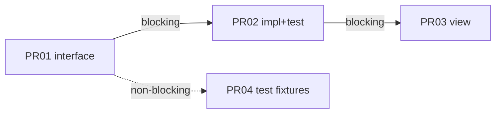

# Split Pull Request Rule

大きな変更を、ジュニアエンジニアでも **10 分以内に確認できる** Pull Request 群へ分ける。
本 SKILL は分割方針・ブランチ名・依存関係の提案までを担う。実際のブランチ作成・コミット・`gh pr create` は行わない。

## いつ使うか

* ユーザーが PR 分割を指示したとき
* 差分・計画・実装が 1 PR ではレビュー負荷が高そうで、分割を検討すべきとき
* Stacked PR（依存する一連の PR）として出す前提で、順序とブロッキングを整理したいとき
* `/split-to-prs` など実行系と組み合わせ、先に「どう分けるか」を固めるとき

## いつ使わないか

* 単純に 1 本の PR を作成・更新するだけのとき（本文起草・`gh pr create` のみ）
* ブランチ命名規則だけが論点のとき（分割が不要な場合）
* コード実装・バグ修正そのもので、PR 境界の設計が不要なとき

## 役割分担

| 役割 | 担当 |
| --- | --- |
| 分割方針・PR 一覧・依存グラフ・ブランチ名案 | **本 SKILL** |
| ブランチ作成・コミット分割・PR 作成の実行 | `/split-to-prs` 等の実行系（ユーザー承認後） |

分割により元ブランチのコミット履歴が失われてもよい。履歴保全よりレビュー粒度を優先する。

## 分割方針（優先度順）

1. **確認時間**: 1 PR は、想定レビュアー（ジュニアエンジニア）が **10 分以内** に確認できる粒度にする（最優先）
2. **低レイヤー → 高レイヤー**: 独立した関連機能ごとに PR を切り、下位からマージできる順にする
3. **インターフェースと実装**: 分離しているなら別 PR。順序はインターフェース → 実装（＋その Unit Test）
4. **実装と Unit Test**: 紐づく実装と Unit Test は同一 PR
5. **単一関心への紐付け**: ある機能（クラス・関数など）にだけ属する変更は同一 PR でよい
6. **限定スコープ**: private 等、呼び出し範囲が狭いものは呼び出し元と同一 PR
7. **UI 境界**: 画面実装があり MVVM 等で境界がある場合は、Model+ViewModel → View のように境界で分割する（同等の分離があれば同じ考え方）
8. **アーキテクチャレイヤー**: レイヤーが分かれているならレイヤーごとに分割する
9. **テスト前提データ**: テスト用・ダミーデータの追加など、「あるテストの前提」かつ独立レビューすべきものは別 PR
10. **前提整備**: 「本実装の前提として既存コードを先に直す」類は先行 PR に切り出す

言語・フレームワーク固有の用語に依存せず、リポジトリの実際の境界（パッケージ、モジュール、レイヤー、公開 API）に当てはめて判断する。

## ブランチ名

分割後の各ブランチは次の形式にする。

```text
{元のブランチ名}-{通し番号}-{内容}
```

* `{元のブランチ名}`: 分割元の作業ブランチ名をそのまま使う
* `{通し番号}`: `01`, `02`, … のようにゼロ埋め 2 桁を推奨（推奨マージ順と揃える）
* `{内容}`: その PR の関心が分かる短い英数字・ハイフン（例: `add-auth-interface`, `impl-auth`, `ui-login`）

**例:** 元ブランチが `feature/id/42/add-login` のとき

* `feature/id/42/add-login-01-auth-interface`
* `feature/id/42/add-login-02-auth-impl`
* `feature/id/42/add-login-03-login-view`

## 依存関係（Stacked PR 前提）

Stacked PR が有効であることを前提に、PR 間の依存を次で区別する。

* **blocking（ブロッキング）**: 後続 PR のレビュー・マージ前に、先行 PR のマージ（または同等の取り込み）が必要
* **non-blocking（非ブロッキング）**: 並行レビュー可能。マージ順の好みやコンフリクト回避のための順序付けはあるが、論理的には独立

依存がある場合は Mermaid で可視化する。blocking / non-blocking が読み取れるようにする（例: 実線＝blocking、破線＝non-blocking。またはラベルで明示）。



独立して base へ出せる PR は無理にスタックしない。本当に依存があるときだけスタックする。

## 作業手順

1. 変更のまとまり（差分・計画・説明）を読む
2. 上記方針で候補スライスを切る（10 分レビューを超える塊はさらに割る）
3. ジュニア向けに、レビューしやすい順・依存でグルーピングし直す
4. ブランチ名を `{元ブランチ}-{通し番号}-{内容}` で付ける
5. 次の出力フォーマットで分割案を返す（実行はしない）
6. ユーザーが承認したら、実行は `/split-to-prs` 等に委ねる旨を短く示す

## 出力フォーマット

必ず次の構成で返す。

### 1. 分割方針の要約

* なぜ分割するか（レビュー負荷・依存・レイヤーなど）
* 何を同一 PR に残したか（方針 4〜6 の適用結果）

### 2. PR 一覧

各 PR について次を列挙する。

| 項目 | 内容 |
| --- | --- |
| 通し番号 | `01`, `02`, … |
| タイトル案 | 変更内容が分かる短文 |
| ブランチ名案 | `{元ブランチ}-{通し番号}-{内容}` |
| 含める変更 | ファイル群・関心の範囲（具体） |
| 含めない変更 | 意図的に他 PR へ送るもの |
| 依存 | blocking / non-blocking と相手 PR |
| 推奨マージ順 | 全体順序での位置 |

各 PR の「レビュー観点」「チェックリスト」は出力しない。確認項目はエンジニアが必要に応じて個別に決める。

### 3. 依存グラフ（依存がある場合）

* Mermaid（`flowchart` または同等）
* blocking / non-blocking を区別
* 推奨マージ順と矛盾しないこと

依存が無い（すべて独立）場合は、その旨を書き Mermaid は省略してよい。

## 出力例（要約）

```markdown
## 分割方針の要約
認証の公開契約 → 実装+テスト → 画面の順に分け、各 PR を 10 分レビュー可能な粒度にした。
fixtures は実装 PR と独立にレビューできるため non-blocking の別 PR とした。

## PR 一覧
1. **01** 認証インターフェース追加
   - ブランチ: `feature/id/42/add-login-01-auth-interface`
   - 含む: 公開 API / 型定義
   - 依存: なし
2. ...

## 依存グラフ
（Mermaid）
```

## ナレッジベース

### DO: レビュー時間を分割の第一基準にする

* 技術的な美しさより、ジュニアが追える差分サイズを優先する

### DO: 下位レイヤー・前提整備を先に出す

* 後続 PR の理解コストを下げるためである

### DO: 実装とその Unit Test を同一 PR に置く

* 契約変更だけ先出しし、挙動の検証を後回しにしない（インターフェース PR を除く）

### DO: Stacked PR では blocking と non-blocking を明示する

* 並行レビューできるものと、順序必須のものを混同させない

### DO NOT: 本 SKILL 内で `gh` やブランチ操作を実行する

* 方針決定までが責務。実行はユーザー承認後に実行系へ渡す

### DO NOT: PR ごとにレビュー観点やチェックリストを書く

* 分割境界・依存・マージ順の提示までが責務。確認項目はエンジニアが必要に応じて決める

### DO NOT: 「とりあえず全部 1 PR」や「ファイル数だけで機械分割」する

* 関心・依存・レイヤー境界で切る

### DO NOT: 言語や特定アプリの作法を前提に一般化する

* 例示は汎用概念（interface / implementation / layer / view）に留め、リポジトリの実境界に写像する
